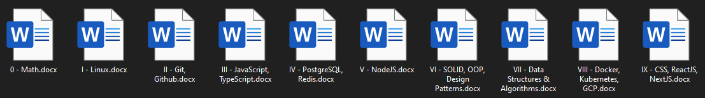

  

<h1 align="center">Tech Stack</h1>

  Some of my notes.

  <em>
    After seeing my friends' interest in my notes and reflecting on my own experience of using them (keeping them in Word/PDF format is not that efficient in terms of accessibility and ease of use), I have come to the idea that it would be nice if I combine them under one roof and publish them on GitHub by creating a documentation style repository.
  </em>

  

> [!WARNING]
> I am not a teacher; these are the notes that I took in the past for myself.

 

 

## Contents

- **Math** `planned ⚫`
- [**Linux** (Debian based)](./linux/README.md) `🟢`
- [**Git**](./git/README.md) `🟢`
- [**JavaScript**](./js/README.md) `in-progress 🟡`
- [**Data Structures & Algorithms**](./dsa/README.md) `in-progress 🟡`
- [**Docker**](./docker/README.md) `in-progress 🟡`
- [**React.js**](./react/README.md) `in-progress 🟡`
- **Node.js (Express)** `planned ⚫`
- [**TypeScript**](./ts/README.md) `🟢`
- **SQL (PostgreSQL)** `planned ⚫`
- **Redis** `planned ⚫`
- **GitHub Actions** `planned ⚫`
- **Kubernetes** `planned ⚫`
- **Amazon Web Services (AWS)** `planned ⚫`
