<p align="center">
  
</p>

<h1 align="center">Data Structures & Algorithms</h1>

<p align="center">
  Almost everything about DSA to ace a technical interview.
</p>

> "Data Structures & Algorithms" is a fundamental topic in computer science and programming. It allows you to organize and manipulate data efficiently, as well as develop algorithms to solve computational problems.

<p align="right">
    <a href="https://github.com/seabeya/tech-stack#tech-stack">Main Page ↖</a>
</p>

#### Knowledge requirements

- A basic knowledge of one of the general-purpose programming languages is required!
  > I'm using JavaScript here, but you can apply the same concepts in other languages.

### Contents

1. [Complexity (Big O)](#-complexity-big-o)
   - [BigO Rules](#-bigo-rules)
2. [Data Structures](#-data-structures)
   - [Array](#-array)
   - [Hash Table](#-hash-table)
   - [Linked List](#-linked-list)
   - [Stack](#-stack)
   - [Queue](#-queue)
   - [Trees](#-trees)
     - [Binary Search Tree](#-binary-search-tree)
   - [Binary Heaps](#-binary-heaps)
   - [Trie (Prefix Tree)](#-trie-prefix-tree)
   - [Graphs](#-graphs)
   - [Matrix (2D Arrays)](#-matrix-2d-arrays)
3. [Algorithms](#-algorithms)
   - [Recursion](#-recursion)
   - [Sorting](#-sorting)
     - [Bubble Sort](#-bubble-sort)
     - [Selection Sort](#-selection-sort)
     - [Insertion Sort](#-insertion-sort)
     - [Merge Sort](#-merge-sort)
     - [Quick Sort](#-quick-sort)
   - [Searching](#-searching)
     - [Linear Search](#-linear-search)

<br>

<hr>

## 🔶 Complexity (Big O)

By analyzing the complexity of an algorithm, we can understand how it will perform for larger inputs. It provides a way to describe the efficiency and scalability of algorithms in a standardized manner.

- Time Complexity: Speed
  > Amount of time or number of operations required by an algorithm to run as a function of the input size.
- Space Complexity: Memory
  > Amount of memory or space required by an algorithm to run as a function of the input size.

<br>

Overview:

- `O(1)`: Constant.
  > Algorithms take a constant amount of time regardless of the input size.
- `O(log n)`: Logarithmic. _(Example: Binary Search)_
  > This type of algorithm reduces the search space by half with each iteration, making it very efficient for large inputs.
- `O(n)`: Linear. _(Example: Linear Search)_
  > This type of algorithm iterates through each element of the input.
- `O(n log n)`: Log Linear. _(Example: Merge Sort, Quick Sort)_
  > Algorithms with a time complexity that grows logarithmically with the input size 'n' are often multiplied by a linear factor. This type of complexity often arises in algorithms that employ the Divide and Conquer approach.
- `O(n^2)`: Quadratic. _(Example: Bubble Sort)_
  > This type of algorithm compares each element of the input with every other element, resulting in nested loops and potentially slow performance for large inputs.
- `O(n^3)` - Cubic.
  > Algorithms with triple nested loops, where each element needs to be compared or operated on with every other element.
- `O(2^n)`: Exponential. _(Example: Power Set Generation)_
  > These algorithms grow exponentially with the input size, often resulting from recursive approaches that generate all possible combinations or subsets.
- `O(n!)`: - Factorial.
  > Algorithms with factorial time complexity typically involve generating permutations or combinations by iterating through all possible orderings or selections of the input elements.

<br>

<p align="center">
  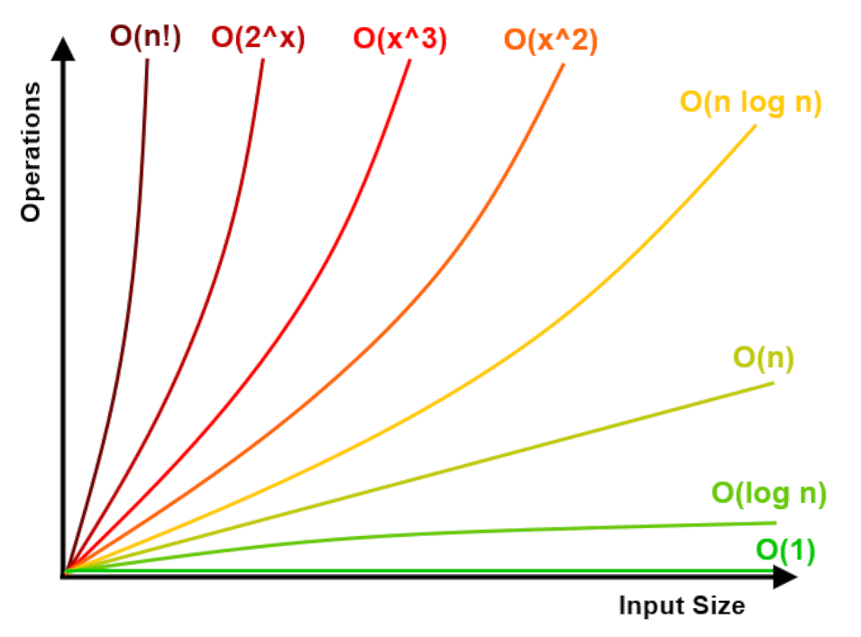
</p>

<br>

### 🔷 BigO Rules

1. Worst case.

   > Big O notation focuses on the upper bound of an algorithm's time complexity, specifically considering the worst-case scenario, independent of luck or assumptions about specific scenarios.

   > This rule allows us to account for the most time-consuming operations an algorithm may encounter and provides a guarantee that the algorithm will not exceed the specified time complexity.

2. Remove constants.

   > Constant factors are not significant in Big O notation. When analyzing the time complexity of an algorithm, we are interested in its growth rate as the input size increases. Constant factors, such as coefficients and low-order terms, become less significant as the input size grows larger.

   > We typically omit these constants when expressing the time complexity in Big O notation. For example, if an algorithm has a time complexity of O(5n), we can simplify it to O(n).

3. Different inputs different variables.

   > If an algorithm's time complexity depends on different input variables, it's important to assign distinct variables or symbols to represent each input parameter.

   - When loops one after another.

     - Same inputs: `O(a + a)` --> `O(2a)` --> `O(n)`
       ```js
       func(a) {
        a.loop1 {}
        a.loop2 {}
       }
       ```
     - Different inputs: `O(a + b)` --> `O(a + b)`
       ```js
       func(a, b) {
        a.loop1 {}
        b.loop2 {}
       }
       ```

   - When loops nested.

     - Same inputs: `O(a * a)` --> `O(a^2)`
       ```js
       func(a) {
        a.loop1 {
          a.loop2 {}
        }
       }
       ```
     - Different inputs: `O(a * b)`
       ```js
       func(a, b) {
        a.loop1 {
          b.loop2 {}
        }
       }
       ```

   > This rule helps s avoid confusion and ensures that the time complexity analysis captures the impact of each input parameter separately.

4. Drop the non-dominant terms.

   > Focus on the most significant term. In algorithms with multiple terms, only the one with the highest growth rate has a significant impact on the overall complexity. Therefore, we keep only the term with the highest growth rate and drop the rest.

   > The function has O(n) and O(n^2) terms, the overall complexity is O(n^2), as it dominates the other term.

   ```js
   func(a) {
    a.loop1 {}
    a.loop2 {
      a.loop3 {}
    }
   }
   ```

<p align="right">
    <a href="#data-structures--algorithms">back to top ⬆</a>
</p>

<br>
<br>

# 🟪 Data Structures

<p align="center">
  <a href="#-array">Array</a> • <a href="#-hash-table">Hash Table</a> • <a href="#-linked-list">Linked List</a> • <a href="#-stack">Stack</a> • <a href="#-queue">Queue</a> • <a href="#-trees">Trees</a> • <a href="#-binary-heaps">Binary Heaps</a> • <a href="#-trie-prefix-tree">Trie (Prefix Tree)</a> • <a href="#-graphs">Graphs</a> • <a href="#-matrix-2d-arrays">Matrix (2D Arrays)</a>
</p>

> [!NOTE]
> In this section, I will cover the structure, implementation, and additional notes of some data structures. However, I will not cover advanced algorithms such as BFS and DFS, even if they are related to the data structures discussed here. I will be addressing those in the [Algorithms](#-algorithms) section.

<br>

## 🔶 Array

Array is a built-in data structure that allows you to store multiple values in a single variable. Each value in an array is called an element, and elements are accessed using their index, which starts from 0 for the first element.

| Operations                 | Complexity | Why                                                                                                                           |
| -------------------------- | ---------- | ----------------------------------------------------------------------------------------------------------------------------- |
| Access / Edit i-th element | `O(1)`     | Arrays provide direct access to elements using their index.                                                                   |
| Insert\* / Remove end      | `O(1)`     | Inserting or removing an element at the end simply requires adjusting the index of the last element.                          |
| Insert / Remove            | `O(n)`     | Inserting or removing an element at a specific index requires shifting all the subsequent elements to accommodate the change. |

<br>

#### 🔻 How arrays stored in memory

In lower-level languages like C or C++, arrays are typically implemented as contiguous memory blocks.

> This means that the elements of the array are stored in consecutive memory locations, one after another, without any gaps or padding between them.

> When an array is created, a block of memory is allocated to hold all its elements. The memory addresses of the elements are determined based on the starting address of the array. The address of the first element is the starting address, and the subsequent elements are stored at increasing memory addresses.

```c++
int myArray[5] = {3, 7, 1, 2, 3};
```

> Assuming each integer occupies 4 bytes of memory, the memory addresses of the elements would be as follows:

```c++
Address of myArray[0] = starting address
Address of myArray[1] = starting address + 4
Address of myArray[2] = starting address + 8
Address of myArray[3] = starting address + 12
Address of myArray[4] = starting address + 16
```

> By having contiguous memory storage, accessing array elements becomes efficient. Since the elements are stored consecutively, the memory address of any element can be calculated using the starting address and the size of each element. This allows for direct access to any element using simple arithmetic calculations, without the need for traversal or searching.

<br>

#### 🔻 Static and Dynamic arrays

- Static Arrays:
  - Static arrays have a fixed size that is declared in advance.
  - They occupy a predetermined amount of memory throughout the program's lifetime.
  - If you try to add more elements than the array size allows, you may encounter overflow errors or memory corruption.
- Dynamic Arrays:
  - Dynamic arrays do not require a specific size to be declared in advance.
  - They can grow or shrink as needed during runtime.
  - Some languages may have a default value for the initial capacity of a dynamic array. When the capacity is exceeded, the array needs to be resized.
  - Resizing a dynamic array typically involves creating a new, larger block of memory (often 2x or 1.5x the previous size), copying all the existing elements to the new block, and deallocating the old block.
    > The worst-case scenario for resizing a dynamic array has a time complexity of O(n), as it requires copying all the elements to a new memory block one by one.

<br>

#### 🔻 Arrays in JavaScript

```js
const myArray = [1, 2, 6, 3, "test"];
const myArray = new Array(5); // Array sized 5
```

> [!NOTE]
> JavaScript is not a low-level language; therefore, the JS engine performs various optimizations under the hood. The implementation of certain features may differ from other languages, depending on the specific approach taken by the engine.

The implementation of JavaScript arrays also depends on the executing engine, the type of elements in the array, and how the array is used. Here is the [V8 implementation ↗](https://chromium.googlesource.com/v8/v8.git/+/refs/heads/main/src/builtins/builtins-array.cc).

> In V8, integer arrays are backed by an array of integers, floating-point arrays are backed by an array of doubles, and object arrays are backed by an array of pointers.

> If an array contains gaps, it is considered a sparse array (an array without gaps is considered a packed array). Sparse arrays are backed by an array in memory if they are not too sparse, but they are backed by a <ins>**hashtable**</ins> if they are very sparse.

> The way JavaScript arrays are implemented can have a significant impact on performance. For example, sparse arrays are slower to access than packed arrays.

> The implementation of JavaScript arrays can also affect the way certain operations are performed on arrays. For example, the `push()` method will behave differently on a packed array than on a sparse array.

> The V8 array implementation includes a number of constants that are used to determine how the array is stored and accessed. To understand better please have a look: ["Mathias Bynens - V8 internals for JavaScript developers" ↗](https://youtu.be/m9cTaYI95Zc).

<p align="right">
    <a href="#data-structures--algorithms">back to top ⬆</a>
</p>

<br>
<br>

## 🔶 Hash Table

A hash table, also known as a hash map, is a data structure that allows efficient storage and retrieval of key-value pairs.

| Operations    | Complexity |
| ------------- | ---------- |
| Access / Edit | `O(1)`     |
| Insert        | `O(1)`     |
| Remove        | `O(1)`     |

<br>

JavaScript doesn't have a built-in data structure called a "hash table". But you can implement similar functionality using objects ({}) and the built-in [Map object ↗](https://developer.mozilla.org/en-US/docs/Web/JavaScript/Reference/Global_Objects/Map).

- Using Objects as Hash Tables:
  ```js
  const hashTable = {};
  ```
- Using the Map object:

  ```js
  const hashTable = new Map();
  ```

> Hash Tables are often the best approach for optimizing time complexity with some additional space costs.

<p align="right">
    <a href="#data-structures--algorithms">back to top ⬆</a>
</p>

<br>
<br>

## 🔶 Linked List

A linked list is a linear data structure that consists of a sequence of elements called nodes.

| Operations                 | Complexity | Why                                                                                                                                                                                                                                   |
| -------------------------- | :--------: | ------------------------------------------------------------------------------------------------------------------------------------------------------------------------------------------------------------------------------------- |
| Access / Edit first & last |   `O(1)`   | Because a linked list maintains references to the first and last elements.                                                                                                                                                            |
| Insert front & end         |   `O(1)`   | We have references to the first and last elements, so we can easily insert an item at the front or end of the linked list and update the appropriate references.                                                                      |
| Delete first & (\*last)    |   `O(1)`   | Since we have reference to the first element, we can easily update the reference of the first element to point to the second element. \*Deleting the last element in O(1) time is only possible if we are using a Doubly Linked List. |
| Access / Edit              |   `O(n)`   | Requires traversing the list to reach the desired position.                                                                                                                                                                           |
| Insert                     |   `O(n)`   | Requires traversing the list to reach the desired position.                                                                                                                                                                           |
| Delete                     |   `O(n)`   | Requires traversing the list to reach the desired position.                                                                                                                                                                           |

<br>

#### 🔻 Structure

Linked lists are made up of list nodes.

> Each node in a linked list can be located anywhere in memory; it does not require contiguous blocks of memory. The order of nodes is maintained through the use of pointers.

- Singly Linked List

  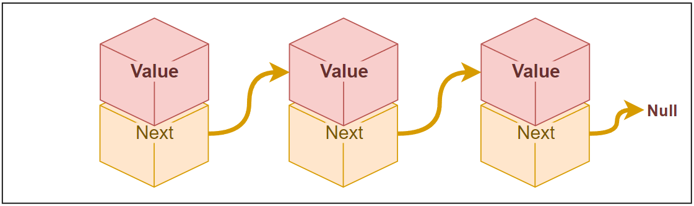

  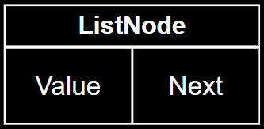

  - **Value**: The data that a list node holds. It can be anything.
  - **Next**: A pointer/reference that indicates the next list node in the linked list. `ListNode1.next = ListNode2`

- Doubly Lined List

  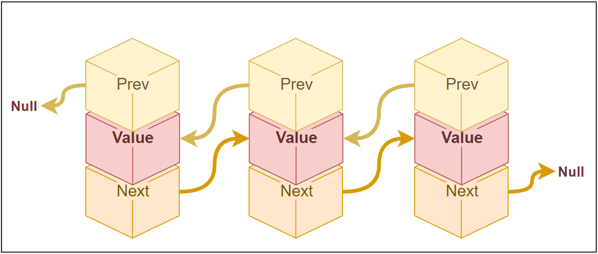

  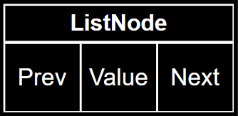

  - **Value**: The data that list node holds. It can be anything.
  - **Next**: A pointer/reference that says what is the next list node in th linked list. `ListNode1.next = ListNode2`
  - **Prev**: A pointer/reference that indicates the previous list node in the linked list. `ListNode2.prev = ListNode1`

<br>

#### 🔻 Implementation

There is no Linked List data structure in JavaScript by default, but we can build it.

Singly Linked List:

```js
class ListNode {
  constructor(value) {
    this.value = value;
    this.next = null;
  }
}

class LinkedList {
  constructor() {
    this.head = null; // First Node
    this.tail = null; // Last Node
    this.size = 0;
  }

  // Access any (by index)
  get(index) {
    if (index < 0 || index >= this.size) {
      throw new Error("Invalid index");
    }

    let currNode = this.head;
    for (let i = 0; i < index; i++) {
      currNode = currNode.next;
    }

    return currNode;
  }

  // Insert end
  append(value) {
    const newNode = new ListNode(value);

    if (this.head === null) {
      this.head = newNode;
      this.tail = newNode;
    } else {
      this.tail.next = newNode;
      this.tail = newNode;
    }

    this.size++;
  }

  // Insert front
  prepend(value) {
    const newNode = new ListNode(value);

    if (this.head === null) {
      this.head = newNode;
      this.tail = newNode;
    } else {
      newNode.next = this.head;
      this.head = newNode;
    }

    this.size++;
  }

  // Insert any
  insertAt(index, value) {
    if (index <= 0) {
      this.prepend(value);
    } else if (index >= this.size) {
      this.append(value);
    } else {
      const newNode = new ListNode(value);
      const parent = this.get(index - 1);
      newNode.next = parent.next;
      parent.next = newNode;
      this.size++;
    }
  }

  // Delete any (by index)
  deleteAt(index) {
    if (this.head === null) {
      throw new Error("List is empty!");
    }

    if (index < 0 || index >= this.size) {
      throw new Error("Invalid index");
    } else if (index === 0) {
      this.head = this.head.next;

      if (this.head === null) {
        this.tail = null;
      }
    } else {
      const parent = this.get(index - 1);
      parent.next = parent.next.next;

      if (index === this.size - 1) {
        this.tail = parent;
      }

      this.size--;
    }
  }

  // Just a random extra method
  toArray() {
    const list = [];
    let currNode = this.head;

    while (currNode !== null) {
      list.push(currNode.value);
      currNode = currNode.next;
    }

    return list;
  }
}

const myList = new LinkedList();

myList.append("000");
myList.append(1);
myList.append("string 2");
myList.insertAt(2, "new 2");
console.log(myList.toArray()); // Array(4) ['000', 1, 'new 2', 'string 2']
myList.prepend({ test: "object data" });
myList.deleteAt(2);
console.log(myList.get(3)); // ListNode {value: 'string 2', next: null}
console.log(myList.toArray()); // Array(4) [{…}, '000', 'new 2', 'string 2']
```

<p align="right">
    <a href="#data-structures--algorithms">back to top ⬆</a>
</p>

<br>
<br>

## 🔶 Stack

> Last-In-First-Out

The term "stack" refers to a data structure that follows the Last-In-First-Out (LIFO) principle. It is a collection of elements that supports two main operations: push and pop.

| Operations           | Complexity |
| -------------------- | ---------- |
| Push (insert end)    | `O(1)`     |
| Pop (delete end)     | `O(1)`     |
| Peek (view last/top) | `O(1)`     |

<br>

#### 🔻 Implementation

There is no built-in Stacks data structure in JavaScript by default, but we can build one using two main options: using an array or using a linked list.

Array-based stacks:

- Good: `Random access`, `Easy to implement`;
- Bad: `Inset/Delete start & middle`, `When stack size is unknown in advance`;

```js
class Stack {
  constructor() {
    this.stack = [];
  }

  push(value) {
    this.stack.push(value);
  }

  pop() {
    if (this.stack.length === 0) {
      throw new Error("Cannot pop from an empty stack");
    }

    return this.stack.pop();
  }

  peek() {
    if (this.stack.length === 0) {
      throw new Error("Stack is empty");
    }

    return this.stack.at(-1);
  }
}

const stack = new Stack();
stack.push(1);
stack.push(2);
stack.push(3);

console.log(stack.peek()); // 3
console.log(stack.pop()); // 3
console.log(stack.pop()); // 2
console.log(stack.pop()); // 1
console.log(stack.peek()); // Error: Stack is empty
```

<br>

Linked list-based stacks:

> As we know, it is not efficient to delete an item at the end of a Singly Linked List. But, instead of adding to the end and removing from the end, we can add to the front and remove from the front. This way, we can achieve our goals efficiently.

- Good: `Can grow/shrink as needed`;
- Bad: `Random access`;

```js
class StackNode {
  constructor(value) {
    this.value = value;
    this.next = null;
  }
}

class Stack {
  constructor() {
    this.top = null;
    this.size = 0;
  }

  // Add item to the beginning of the list:
  push(value) {
    const newNode = new StackNode(value);
    newNode.next = this.top;
    this.top = newNode;
    this.size++;
  }

  // Delete item from the beginning of the list:
  pop() {
    if (this.top === null) {
      throw new Error("Cannot pop from an empty stack");
    }

    const node = this.top;
    this.top = node.next;
    this.size--;
    return node.value;
  }

  peek() {
    if (this.top === null) {
      throw new Error("Cannot peek an empty stack");
    }

    return this.top.value;
  }
}

const stack = new Stack();
stack.push(1);
stack.push(2);
stack.push(3);

console.log(stack.peek()); // 3
console.log(stack.pop()); // 3
console.log(stack.pop()); // 2
console.log(stack.pop()); // 1
console.log(stack.peek()); // Error: Cannot peek an empty stack
```

<p align="right">
    <a href="#data-structures--algorithms">back to top ⬆</a>
</p>

<br>
<br>

## 🔶 Queue

> First-In-First-Out

The term "queue" refers to a data structure that follows the First-In-First-Out (FIFO) principle, which means that the element that is inserted first will be the first one to be removed.

> It is analogous to a real-life queue or line where people stand in, and the person who arrives first is served first.

| Operations             | Complexity |
| ---------------------- | ---------- |
| Enqueue (insert end)   | `O(1)`     |
| Dequeue (delete front) | `O(1)`     |
| Peek (view first/top)  | `O(1)`     |

<br>

#### 🔻 Implementation

There is no built-in Queue data structure in JavaScript by default, but we can implement it using a Singly Linked List.

```js
class QueueNode {
  constructor(value) {
    this.value = value;
    this.next = null;
  }
}

class Queue {
  constructor() {
    this.top = null; // top priority
    this.tail = null; // least priority
    this.size = 0;
  }

  // Add item to the end of the list:
  enqueue(value) {
    const newNode = new QueueNode(value);

    if (!this.top) {
      this.top = newNode;
    } else {
      this.tail.next = newNode;
    }

    this.tail = newNode;
    this.size++;
  }

  // Delete item from the beginning of the list:
  dequeue() {
    if (this.top === null) {
      throw new Error("Queue is empty!");
    }

    const dequeuedValue = this.top.value;

    this.top = this.top.next;
    this.size--;

    if (this.size === 0) {
      this.tail = null;
    }

    return dequeuedValue;
  }

  // Show the top item
  peek() {
    if (this.top === null) {
      throw new Error("Queue is empty!");
    }

    return this.top.value;
  }
}
```

<p align="right">
    <a href="#data-structures--algorithms">back to top ⬆</a>
</p>

<br>
<br>

## 🔶 Trees

A tree is a hierarchical data structure in computer science that resembles a tree structure with a set of connected nodes.

**Terminology**

- `Root`: The topmost node in a tree. It serves as the starting point of the tree and has no parent.
- `Parent`: The node that is connected to its child nodes. Each child can have only one parent.
- `Child`: The nodes directly connected to a parent node. A parent node can have multiple child nodes.
- `Sibling`: Nodes that share the same parent are called siblings. They are at the same level in the tree.
- `Leaf`: Also known as a terminal node or external node, it is a node that has no child nodes.
- `Edge`: A connection or link between two nodes in a tree.
- `Path`: A sequence of nodes connected by edges, from one node to another in a tree.
- `Depth`: The depth of a node represents the number of edges from the root to that node. The root node has a depth of 0.
- `Height`: Height refers to the longest path from the root to any leaf node, or the maximum depth among all nodes in the tree.
- `Subtree`: A subtree is a tree structure that is part of a larger tree.

<p align="center">
  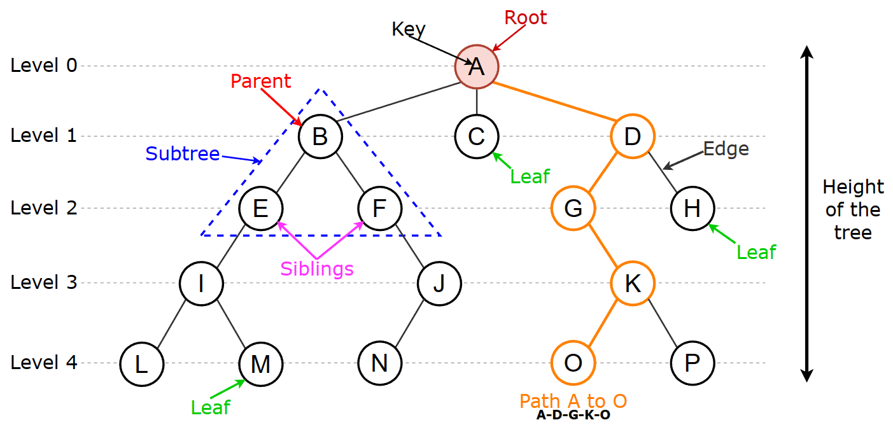
</p>

<br>

#### 🔻 Binary Trees

A binary tree is a type of tree data structure in which each node can have at most two child nodes, known as the left child and the right child.

> It is called a "binary" tree because the branching factor of each node is limited to two.

**Types of binary trees:**

<p align="center">
  
</p>

- Full Binary Tree:

  > A full binary tree is a binary tree in which every node has either zero or two children.

- Perfect Binary Tree:

  > A perfect binary tree is a binary tree in which all levels are completely filled with nodes, and all leaf nodes are at the same level.

  - Node count in each level: `2^curr_level`.
  - Last level node count: `The number of nodes in all the levels above it plus 1`.
    > Which means half of our nodes are in the last level.
  - Total node count: `2^(height + 1) - 1`.

- Complete Binary Tree:

  > A complete binary tree is a binary tree in which all levels are completely filled except possibly the last level, which is filled from left to right.

- Balanced Binary Tree:

  > A balanced binary tree is a binary tree in which the heights of the left and right subtrees of any node differ by at most one. Balancing the tree helps to ensure efficient operations and maintain a more uniform structure.

  > When every inserted item is greater or smaller than its parent, or certain deletion operations are performed, the tree becomes unbalanced. In an unbalanced tree, lookup, insert, and delete operations have a time complexity of `O(h)` because the tree resembles a linked list. To solve this issue, we can implement [AVL Trees ↗](https://medium.com/basecs/the-little-avl-tree-that-could-86a3cae410c7) or [Red-Black Trees ↗](https://medium.com/basecs/painting-nodes-black-with-red-black-trees-60eacb2be9a5). These data structures perform a switch or rotation after add/delete operations to balance the tree.

<br>

### 🔷 Binary Search Tree

A Binary Search Tree (BST) is a type of binary tree that ensures the elements are stored in a specific order, allowing for efficient searching, insertion, and deletion operations.

| Operations      | Complexity | Why                                                                |
| --------------- | :--------: | ------------------------------------------------------------------ |
| Search / Lookup | `O(log n)` |                                                                    |
| Insert          | `O(log n)` | You need to search for an eligible place to insert the given item. |
| Remove          | `O(log n)` | You need to search for the item you want to remove.                |

- Nodes in the left subtree are smaller than the current node.
- Nodes in the right subtree are greater than or equal to the current node.

<p align="center">
    <b>Left Child</b> < <b>Parent</b> <= <b>Right Child</b>
</p>

<p align="center">
  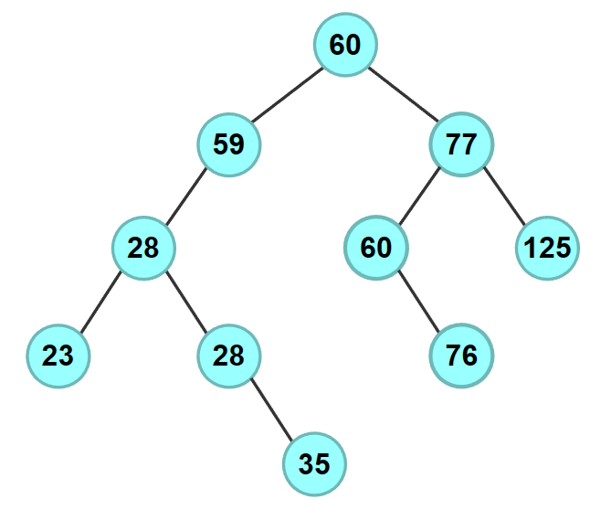
</p>

<br>

#### 🔻 Implementation

```js
class TreeNode {
  constructor(value) {
    this.value = value;
    this.left = null;
    this.right = null;
  }
}

class BinarySearchTree {
  constructor() {
    this.root = null;
  }

  lookup(value) { ... } //
  insert(value) { ... } //
  remove(value) { ... } //
}

const tree = new BinarySearchTree();
tree.insert(12);
tree.insert(9);
tree.insert(25);
tree.insert(5);
tree.insert(20);
tree.remove(9);
console.log(tree.lookup(12)); // TreeNode {value: 12, left: TreeNode, right: TreeNode}
```

<p align="center">
  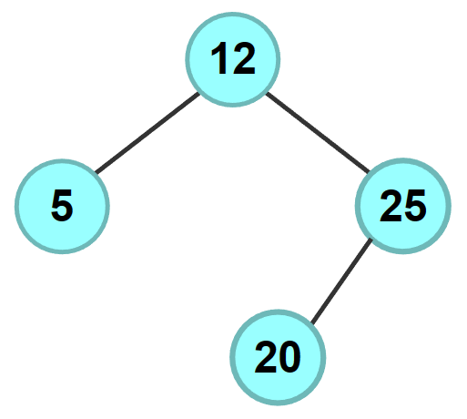
</p>

<details><summary>Lookup: (find node by value)</summary>

<br>
Iterative:

> Greater speed and lower memory requirements with large trees.

```js
lookup(value) {
  let current = this.root;
  while (current) {
    if (value < current.value) {
      current = current.left;
    } else if (value > current.value) {
      current = current.right;
    } else {
      return current;
    }
  }
  return null;
}
```

Recursive:

```js
lookup(value, root = this.root) {
  if (root === null) {
    return null;
  }

  if (value < root.value) {
    return this.lookup(value, root.left);
  } else if (value > root.value) {
    return this.lookup(value, root.right);
  } else {
    return root;
  }
}
```

</details>

<details><summary>Insert:</summary>

<br>
Iterative:

```js
insert(value) {
  const newNode = new TreeNode(value);
  if (this.root === null) {
    this.root = newNode;
    return;
  }

  let current = this.root;
  while (true) {
    // left:
    if (value < current.value) {
      if (current.left === null) {
        current.left = newNode;
        break;
      }
      current = current.left;
    }
    // right:
    else {
      if (current.right === null) {
        current.right = newNode;
        break;
      }
      current = current.right;
    }
  }
}
```

</details>

<details><summary>Remove: (remove node by value)</summary>

<br>

Iterative:

> Greater speed and lower memory requirements with large trees.

```js
remove(value) {
  let current = this.root;
  let parent = null;
  // searching:
  while (current) {
    if (value < current.value) {
      parent = current;
      current = current.left;
    } else if (value > current.value) {
      parent = current;
      current = current.right;
    }
    // found the node:
    else {
      // #1 - node has no right child:
      if (current.right === null) {
        // node is the root node:
        if (parent === null) {
          this.root = current.left;
        } else {
          if (current.value < parent.value) {
            parent.left = current.left;
          } else if (current.value > parent.value) {
            parent.right = current.left;
          }
        }
      }
      // #2 - node has right child but right child has no left child:
      else if (current.right.left === null) {
        // node is the root node:
        if (parent === null) {
          this.root = current.left;
        } else {
          // link current left to current right left:
          current.right.left = current.left;
          if (current.value < parent.value) {
            parent.left = current.right;
          } else if (current.value > parent.value) {
            parent.right = current.right;
          }
        }
      }
      // #3 - node has right child that has a left child:
      else {
        // find the Right child's left most child:
        let leftmost = current.right.left;
        let leftmostParent = current.right;
        while (leftmost.left !== null) {
          leftmostParent = leftmost;
          leftmost = leftmost.left;
        }
        // parent's left subtree is now leftmost's right subtree:
        leftmostParent.left = leftmost.right;
        leftmost.left = current.left;
        leftmost.right = current.right;
        if (parent === null) {
          this.root = leftmost;
        } else {
          if (current.value < parent.value) {
            parent.left = leftmost;
          } else if (current.value > parent.value) {
            parent.tight = leftmost;
          }
        }
      }
      return true;
    }
  }
  return false;
}
```

Recursive:

> Easy to read

```js
remove(value) {
  // helper:
  const findMinValue = (current) => {
    while (current.left) {
      current = current.left;
    }
    return current.value;
  };

  const removeNode = (value, current = this.root) => {
    if (current === null) {
      return null;
    }
    // searching:
    if (value < current.value) {
      current.left = removeNode(value, current.left);
    } else if (value > current.value) {
      current.right = removeNode(value, current.right);
    } // found the node:
    else {
      // it has no children:
      if (current.left === null && current.right === null) {
        current = null;
      } // it has right child:
      else if (current.left === null) {
        current = current.right;
      } // it has left child:
      else if (current.right === null) {
        current = current.left;
      } // it has both children:
      else if (current.left && current.right) {
        current.value = findMinValue(current.right);
        current.right = removeNode(current.value, current.right);
      }
    }
    return current;
  };
  removeNode(value);
}
```

</details>

<p align="right">
    <a href="#data-structures--algorithms">back to top ⬆</a>
</p>

<br>
<br>

## 🔶 Binary Heaps

A binary heap is a data structure that represents a complete binary tree, which can be either a min-heap or a max-heap.

It is commonly used to implement **priority queues**, which allow efficient retrieval of the minimum (or maximum) element.

| Operations | Complexity | Why                                                                    |
| ---------- | :--------: | ---------------------------------------------------------------------- |
| Lookup     |   `O(n)`   | We need to iterate through all elements until we find the given value. |
| Insert     | `O(log n)` | The tree needs to be adjusted to preserve the structure.               |
| Remove top | `O(log n)` | The tree needs to be adjusted to preserve the structure.               |

<br>

#### 🔻 Structure

<p align="center">
  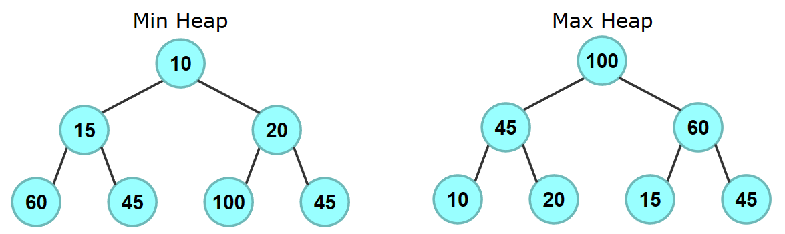
</p>

- Min Heap: The parent is smaller than or equal to all its children.
  > [10, 15, 20, 60, 45, 100, 45]
- Max Heap: The parent is greater than or equal to all its children.
  > [100, 45, 60, 10, 20, 15, 45]

<br>

**Operations in Binary Heaps:**

- Insertion: Time: O(log n); Space: O(n)
  > When we insert an item, we add it at the bottom of the tree (level by level, from left to right) or at the end of the array. Then we check its validity with its parent. If it is not valid, we swap their positions. This process, known as percolation, continues until the heap property is fully restored.
- Deletion: Time: O(log n); Space: O(n)
  > When we delete an item from a heap, we replace the root with the last element, remove the last element, and then restore the heap property by moving the new root down and swapping it with the appropriate child (the smaller child in a min heap or the larger child in a max heap) if necessary. This process, also known as percolation, continues until the heap property is fully restored, and then we return the stored value.

Comparing in a heap:

- Max Heap:
  > When both children are found, first compare child1 and child2. Take the greater value and compare it with the current parent. If the parent is smaller than the child, swap them.
- Min Heap:
  > When both children are found, first compare child1 and child2. Take the smaller value and compare it with the current parent. If the parent is bigger than the child, swap them.

<br>

#### 🔻 Relationships

> These super important formulas allow us to establish relationships between items.

Example heap: [10, 15, 20, 60, 45, 100, 45]

- To find the parent: `parent_idx = floor((node_idx - 1) / 2)`
  > The parent index of 45 = (4-1)/2 = floor(1.5) = 1; and that is 15.
- To find the left child: `leftChild_idx = node_idx * 2 + 1`
  > The left child index of 15 = 1 \* 2 + 1 = 3; adn that i 60.
- To find the right child: `rightChild_idx = idx * 2 + 2`
  > The right child index of 15 = 1 \* 2 + 2 = 4; and that is 45.

<br>

#### 🔻 Implementation

```js
class PriorityQueue {
  constructor() {
    this.heap = [];
  }

  getLeftChildIndex(parentIndex) {
    return 2 * parentIndex + 1;
  }

  getRightChildIndex(parentIndex) {
    return 2 * parentIndex + 2;
  }

  getParentIndex(childIndex) {
    return Math.floor((childIndex - 1) / 2);
  }

  hasLeftChild(index) {
    return this.getLeftChildIndex(index) < this.heap.length;
  }

  hasRightChild(index) {
    return this.getRightChildIndex(index) < this.heap.length;
  }

  hasParent(index) {
    return this.getParentIndex(index) >= 0;
  }

  leftChild(index) {
    return this.heap[this.getLeftChildIndex(index)];
  }

  rightChild(index) {
    return this.heap[this.getRightChildIndex(index)];
  }

  parent(index) {
    return this.heap[this.getParentIndex(index)];
  }

  swap(indexOne, indexTwo) {
    [this.heap[indexOne], this.heap[indexTwo]] = [
      this.heap[indexTwo],
      this.heap[indexOne],
    ];
  }

  peek() {
    if (this.heap.length === 0) {
      return null;
    }

    return this.heap[0];
  }

  insert(item) {
    this.heap.push(item);
    this.percolateUp();
  }

  delete() {
    if (this.heap.length === 0) {
      return null;
    }

    const item = this.heap[0];
    this.heap[0] = this.heap[this.heap.length - 1];
    this.heap.pop();
    this.percolateDown();
    return item;
  }

  // Adjusting:
  percolateUp() { ... } //
  percolateDown() { ... } //

}

// Usage:
const pq = new PriorityQueue();

pq.insert(10);
pq.insert(15);
pq.insert(20);
pq.insert(60);
pq.insert(45);
pq.insert(100);
pq.insert(45);
pq.insert(5);

console.log(pq.delete()); // 5
console.log(pq.heap); // Array(7) [10, 15, 20, 60, 45, 100, 45]
// We used min heap for this example usage.
```

<details><summary>Percolation Min Heap:</summary>

```js
percolateUp() {
  let index = this.heap.length - 1;
  while (this.hasParent(index) && this.parent(index) > this.heap[index]) {
    this.swap(this.getParentIndex(index), index);
    index = this.getParentIndex(index);
  }
}

percolateDown() {
  let index = 0;
  while (this.hasLeftChild(index)) {
    let smallerChildIndex = this.getLeftChildIndex(index);
    if (
      this.hasRightChild(index) &&
      this.rightChild(index) < this.leftChild(index)
    ) {
      smallerChildIndex = this.getRightChildIndex(index);
    }
    if (this.heap[index] < this.heap[smallerChildIndex]) {
      break;
    } else {
      this.swap(index, smallerChildIndex);
    }
    index = smallerChildIndex;
  }
}
```

</details>

<details><summary>Percolation Max Heap:</summary>

```js
percolateUp() {
  let index = this.heap.length - 1;
  while (this.hasParent(index) && this.parent(index) < this.heap[index]) {
    this.swap(this.getParentIndex(index), index);
    index = this.getParentIndex(index);
  }
}

percolateDown() {
  let index = 0;
  while (this.hasLeftChild(index)) {
    let largerChildIndex = this.getLeftChildIndex(index);
    if (
      this.hasRightChild(index) &&
      this.rightChild(index) > this.leftChild(index)
    ) {
      largerChildIndex = this.getRightChildIndex(index);
    }
    if (this.heap[index] > this.heap[largerChildIndex]) {
      break;
    } else {
      this.swap(index, largerChildIndex);
    }
    index = largerChildIndex;
  }
}
```

</details>

<p align="right">
    <a href="#data-structures--algorithms">back to top ⬆</a>
</p>

<br>
<br>

## 🔶 Trie (Prefix Tree)

A trie is a tree-like data structure that provides an efficient solution for storing and searching strings.

> Use cases: Autocomplete, spell checking, dictionary or word lookup, IP routing, caching mechanism, etc.

| Operations    | Complexity              |
| ------------- | ----------------------- |
| Insert Word   | `O(size of the word)`   |
| Search Word   | `O(size of the word)`   |
| Search Prefix | `O(size of the prefix)` |

<br>

#### 🔻 Structure

- Root Node: The root node represents an empty string or the starting point of the Trie.
- Trie Node:
  > Each node in the Trie represents a single character or component of a string. It contains the following elements:
  - Children:
    > A collection of child nodes, typically implemented using a data structure such as a map, dictionary, or an array. It maps each character or component to its corresponding child node.
  - End of Word Flag:
    > A boolean flag that indicates whether the node represents the end of a complete word or string.

<p align="center">
  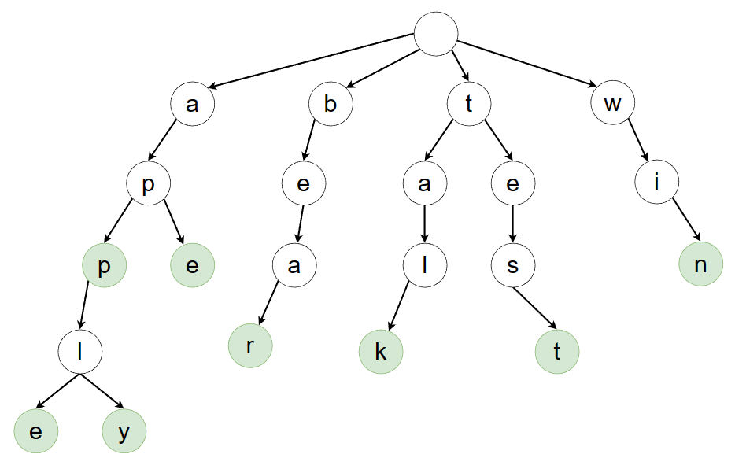
</p>

> In this Trie example, we have the words 'app, apple, apply, ape, bear, talk, test, win' (the green nodes show us that the End of Word Flag is true there).

<br>

#### 🔻 Implementation

```js
class TrieNode {
  constructor() {
    this.children = new Map();
    this.isEndOfWord = false; // isLeaf
  }
}

class Trie {
  constructor() {
    this.root = new TrieNode();
  }

  insert(word) {
    let node = this.root;
    for (let i = 0; i < word.length; i++) {
      const char = word[i];
      if (!node.children.has(char)) {
        node.children.set(char, new TrieNode());
      }
      node = node.children.get(char);
    }
    node.isEndOfWord = true;
  }

  search(word) {
    let node = this.root;
    for (let i = 0; i < word.length; i++) {
      const char = word[i];
      if (!node.children.has(char)) {
        return false;
      }
      node = node.children.get(char);
    }
    return node.isEndOfWord;
  }

  startsWith(prefix) {
    let node = this.root;
    for (let i = 0; i < prefix.length; i++) {
      const char = prefix[i];
      if (!node.children.has(char)) {
        return false;
      }
      node = node.children.get(char);
    }
    return true;
  }
}

// Usage:
const trie = new Trie();

trie.insert("bookmark");
console.log(trie.search("bookmark")); // true
console.log(trie.search("book")); // false
console.log(trie.startsWith("book")); // true
trie.insert("book");
console.log(trie.search("book")); // true
```

<details><summary>(Extra) Implementing suggestions method:</summary>

> This will retrieve suggestions for the given prefix. For example, if we enter 'boo', the output will be an array of suggestions: ['book', 'bookmark'].

```js
suggestions(prefix) {
  let currentNode = this.root;
  for (let i = 0; i < prefix.length; i++) {
    const char = prefix[i];
    if (!currentNode.children.has(char)) {
      return [];
    }
    currentNode = currentNode.children.get(char);
  }
  const suggestions = [];
  this.traverse(currentNode, prefix, suggestions);
  return suggestions;
}

traverse(node, prefix, suggestions) {
  if (node.isEndOfWord) {
    suggestions.push(prefix);
  }
  for (const [char, child] of node.children) {
    const newPrefix = prefix + char;
    this.traverse(child, newPrefix, suggestions);
  }
}
```

</details>

<p align="right">
    <a href="#data-structures--algorithms">back to top ⬆</a>
</p>

<br>
<br>

## 🔶 Graphs

A graph is a data structure consisting of nodes (vertices) and edges that connect pairs of nodes. It is used to represent relationships between entities or elements. The nodes represent objects or concepts, while the edges represent the connections or relationships between them.

> Graphs are excellent data structures for modeling real-world relationships. For example, social networks like Facebook and Twitter use graphs to model connections between users. Similarly, map applications use graphs to recommend the most efficient path to your destination by considering factors such as traffic and other associated costs.

<br>

#### 🔻 Structure

<p align="center">
  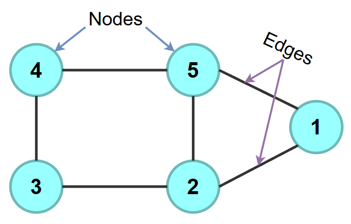
</p>

**Directions:**

- Directed Graph:
  > A directed graph is a type of graph in which edges have specific directions, indicating one-way relationships between nodes.
  <p align="center">
    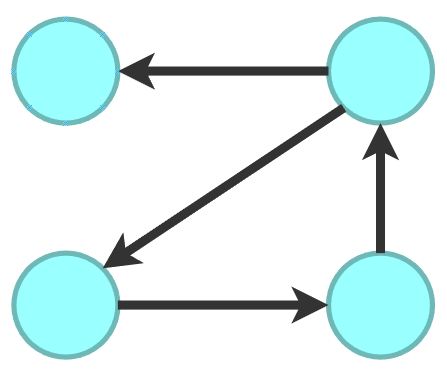
  </p>
- Undirected Graph:
  > An undirected graph is a type of graph in which edges do not have specific directions, indicating a bidirectional relationship between nodes.
  <p align="center">
    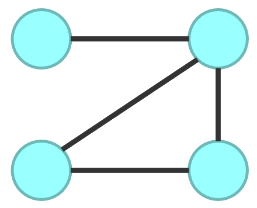
  </p>

**Connections:**

- Cyclic Graph:
  > A cyclic graph is a graph that contains at least one cycle. A cycle in a graph is a path that starts and ends at the same node, without visiting any other node more than once.
  <p align="center">
    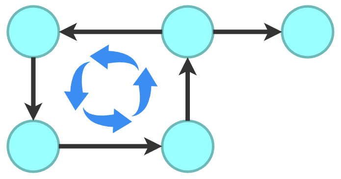
  </p>
- Acyclic Graph:
  > An acyclic graph is a graph that does not contain any cycles. It is the opposite of a cyclic graph.
  <p align="center">
    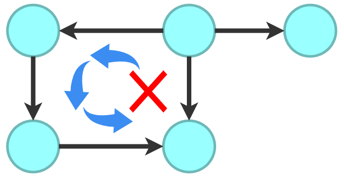
  </p>

**Edge weighting:**

- Unweighted Graphs:
  > An unweighted graph is a graph in which each edge does not have a numerical value or weight associated with it. It means that all edges in the graph are considered to have equal importance or distance.
  <p align="center">
    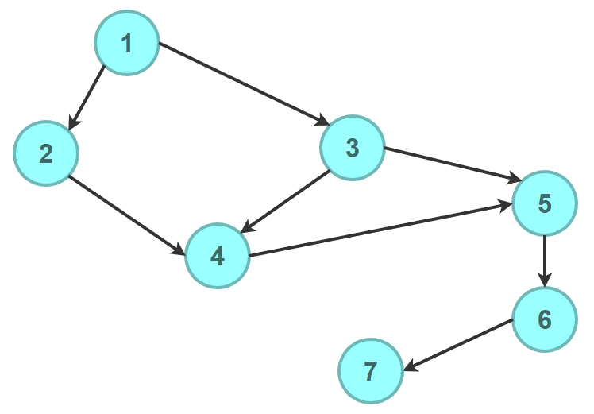
  </p>
- Weighted Graphs:

  > A weighted graph is a graph in which each edge is assigned a numerical value or weight. The weight represents a certain attribute or cost associated with the edge, such as distance, time, cost, capacity, or any other relevant metric.

  <p align="center">
    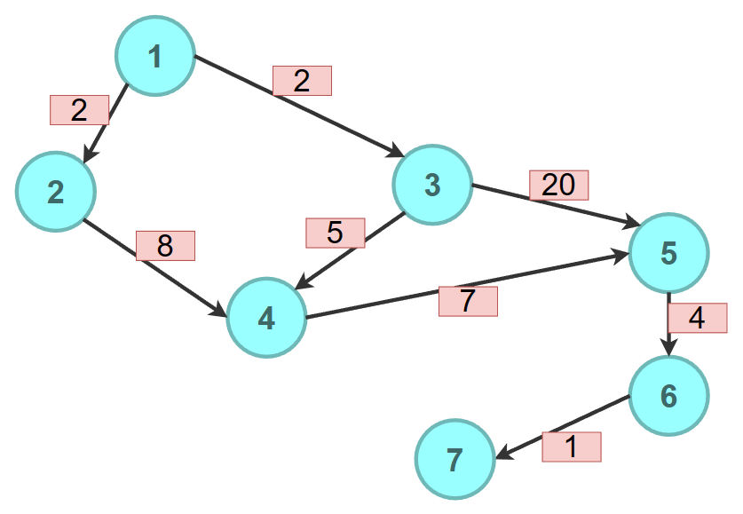
  </p>

  > Let's say the numbers represent the cost of using the edges. If we want to go from 1 to 7, we need to choose the cheapest path, which is 1, 3, 4, 5, 6, 7. This path costs 2 + 5 + 7 + 4 + 1, and it is the cheapest way.

<br>

#### 🔻 Graph Representations

> Example graphs:

<p align="center">
  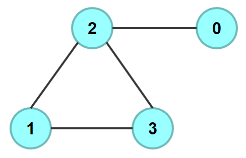
</p>
<p align="center">
  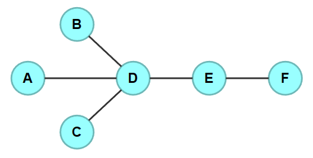
</p>

- Edge List:

  > An edge list is a simple representation of a graph that lists all the edges in the graph. Each edge is typically represented as a pair of nodes that it connects.

  ```js
  const graph = [
    [0, 2],
    [2, 3],
    [2, 1],
    [1, 3],
  ];
  ```

- Adjacency Matrix: `Space: O(v^2)`

  > An adjacency matrix is a square matrix that represents a graph. The rows and columns of the matrix correspond to the nodes of the graph, and the entries indicate whether there is an edge between the vertices.

  > Typically, a value of 1 or true represents the presence of an edge, and a value of 0 or false indicates the absence of an edge.

  ```js
  const graph = {
    //  0  1  2  3
    0: [0, 0, 1, 0], // 0 -> 2
    1: [0, 0, 1, 1], // 1 -> 2,3
    2: [1, 1, 0, 1], // 2 -> 0,1,3
    3: [0, 1, 1, 0], // 3 -> 1,2
  };

  // graph[v1][v2] === 1; means an edge exists from v1 to v2.
  // graph[v2][v1] === 1; means an edge exists from v2 to v1.
  ```

- Adjacency List:

  > An adjacency list represents a graph as a collection of lists. Each node in the graph has an associated list that contains all the nodes adjacent to it.

  > The keys are nodes, and the values are lists of adjacent nodes.

  ```js
  const graph = {
    0: [2],
    1: [2, 3],
    2: [0, 1, 3],
    3: [1, 2],
  };

  const graphChars = {
    A: ["D"],
    B: ["D"],
    C: ["D"],
    D: ["A", "B", "C", "E"],
    E: ["D", "F"],
    F: ["E"],
  };
  ```

<br>

#### 🔻 Implementation

Building adjacent list:

```js
class Graph {
  constructor() {
    this.numberOfNode = 0;
    this.list = {};
  }

  addVertex(node) {
    this.list[node] = [];
    this.numberOfNode++;
  }

  addEdge(node1, node2) {
    // undirected (both sides)
    this.list[node1].push(node2);
    this.list[node2].push(node1);
  }

  // Helper - Show
  show() {
    console.log(this);
  }
}
```

<p align="right">
    <a href="#data-structures--algorithms">back to top ⬆</a>
</p>

<br>
<br>

## 🔶 Matrix (2D Arrays)

A 2D array, also known as a matrix, is a data structure that represents a collection of elements arranged in a two-dimensional grid or table-like format. It consists of rows and columns, where each cell or element within the matrix can be accessed using its row and column indices.

> 2D arrays are useful for representing grids, tables, images, game boards, and other structured data that can be visualized as a two-dimensional arrangement.

<br>

#### 🔻 Structure

The structure of a 2D array allows for efficient access, modification, and traversal of elements within the matrix.

<p align="center">
  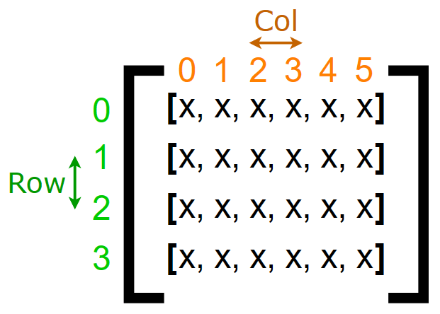
</p>

**Traversals:** `row`,`col`

- Up: `-1`, `0`
- Down: `+1`, `0`
- Left: `0`, `-1`
- Right: `0`, `+1`

> For example, let's say we are at Row 2, Col 3, and we want to go two up. We can achieve this by using the Up formula (-1, 0) twice. This means we subtract 1 from the current row value two times, which gives us Row 0, Col 3 as the resulting location.

```js
[                       ->   [
  [0, 0, 0, 0, 0, 0],   ->     [0, 0, 0, 1, 0, 0],
  [0, 0, 0, 0, 0, 0],   ->     [0, 0, 0, 0, 0, 0],
  [0, 0, 0, 1, 0, 0],   ->     [0, 0, 0, 0, 0, 0],
  [0, 0, 0, 0, 0, 0],   ->     [0, 0, 0, 0, 0, 0],
];                      ->   ]
```

<p align="right">
    <a href="#data-structures--algorithms">back to top ⬆</a>
</p>

<br>
<br>

# 🟪 Algorithms

<p align="center">
  <a href="#-recursion">Recursion</a> •
  <a href="#-sorting">Sorting</a> •
</p>

<br>

## 🔶 Recursion

Recursion in programming is a technique where a function calls itself in order to solve a problem.

Recursion allows you to break down a complex problem into smaller, more manageable subproblems. Each recursive call operates on a smaller piece of the original problem until a base case is reached, at which point the recursion stops.

Recursion is useful when you don't know in advance how many steps or iterations will be needed to find the solution. It allows you to keep going deeper into the problem until you reach a base case that can be easily solved.

- Definitions:

  - Recursive Call:
    > Calling the function again.
  - Base Case:
    > Defines when to stop.
    1. The smallest valid input for the problem.
       > This is often the simplest case where the function can return a result without further recursion.
    2. Termination conditions.
       > The conditions under which the recursive process should stop.
    3. Edge cases.
       > Any edge cases or special scenarios that require specific handling.
  - Recursive case:
    > Making progress towards the base case. It is important that each recursive call brings you closer to the base case.

- Process:

  - Stacking (going down):
    > Each time a function calls itself recursively, a new stack frame is added on top of the previous one, containing the parameters and local variables for that specific invocation of the function.
  - Unfolding (going up):
    > As the base case is reached, the recursion starts to unwind. Each function call returns its value to the previous level of the call stack until the initial function call returns the final result.

<br>

#### 🔻 Step by Step Recursion With Examples

**Example 1:** Factorial

```js
function factorial(num) {
  // Base case:
  if (num === 0 || num === 1) {
    return 1;
  }

  // Recursive case & call:
  return num * factorial(num - 1);
}
```

- Steps: `factorial(5)`

  - Stacking:

    | Stack / Recursion | Current `num` | Base case? | Current recursive case & call  | Next `num` |
    | ----------------- | ------------- | ---------- | ------------------------------ | ---------- |
    | 1st               | `5`           | false      | `return 5 * factorial(5 - 1);` | `4`        |
    | 2nd               | `4`           | false      | `return 4 * factorial(4 - 1);` | `3`        |
    | 3rd               | `3`           | false      | `return 3 * factorial(3 - 1);` | `2`        |
    | 4th               | `2`           | false      | `return 2 * factorial(2 - 1);` | `1`        |
    | 5th               | `1`           | true       | -                              | -          |

  - Unfolding:

    | Stack / Recursion | Current return case | Returned |
    | ----------------- | ------------------- | -------- |
    | 5th               | `return 1;`         | `1`      |
    | 4th               | `return 2 * 1;`     | `2`      |
    | 3rd               | `return 3 * 2;`     | `6`      |
    | 2nd               | `return 4 * 6;`     | `24`     |
    | 1st               | `return 5 * 24;`    | `120`    |

<br>

**Example 2:** Reverse a string

```js
function reverseStr(str) {
  // Base case:
  if (str.length <= 1) {
    return str;
  }

  // Recursive case & call:
  return reverseStr(str.substring(1)) + str[0];
}
```

- Steps: `reverseStr('Hello')`

  - Stacking:

    | Stack / Recursion | Current `str` | Base case? | Current recursive case & call      | Next `str` |
    | ----------------- | ------------- | ---------- | ---------------------------------- | ---------- |
    | 1st               | `'Hello'`     | false      | `return reverseStr('ello') + 'H';` | `'ello'`   |
    | 2nd               | `'ello'`      | false      | `return reverseStr('llo') + 'e';`  | `'llo'`    |
    | 3rd               | `'llo'`       | false      | `return reverseStr('lo') + 'l';`   | `'lo'`     |
    | 4th               | `'lo'`        | false      | `return reverseStr('o') + 'l';`    | `'o'`      |
    | 5th               | `'o'`         | true       | -                                  | -          |

  - Unfolding:

    | Stack / Recursion | Current return case    | Returned |
    | ----------------- | ---------------------- | -------- |
    | 5th               | `return 'o';`          | `o`      |
    | 4th               | `return 'o' + 'l';`    | `ol`     |
    | 3rd               | `return 'ol' + 'l';`   | `oll`    |
    | 2nd               | `return 'oll' + 'e';`  | `olle`   |
    | 1st               | `return 'olle' + 'H';` | `olleH`  |

<p align="right">
    <a href="#data-structures--algorithms">back to top ⬆</a>
</p>

<br>
<br>

## 🔶 Sorting

Sorting algorithms are a set of techniques used to arrange elements, with each algorithm having its own strengths and weaknesses, making it suitable for different scenarios and types of data.

**Stable vs Unstable Sorting:**

- Stable:
  > If two or more elements have the same key value, the stable sorting algorithm will ensure that their relative order in the original list is preserved in the sorted list.
- Unstable:
  > If two or more elements have the same key value, the order in which they appear in the sorted list is not guaranteed to be the same as their order in the original list.

<br>

**Sorting Algorithms:**

| Name           | Stable? | Time                            | Space       | When to use?                                  |
| -------------- | ------- | ------------------------------- | ----------- | --------------------------------------------- |
| Bubble Sort    | `true`  | `O(n^2)`                        | `O(1)`      | Never                                         |
| Selection Sort | `false` | `O(n^2)`                        | `O(1)`      | Never                                         |
| Insertion Sort | `true`  | `O(n^2)`                        | `O(1)`      | Small Datasets; Nearly Sorted Data            |
| Merge Sort     | `true`  | `O(n log(n))`                   | `O(n)`      | Large Datasets; Memory usage is not a problem |
| Quick Sort     | `false` | `O(n log(n))` (worst: `O(n^2)`) | `O(log(n))` | Medium Datasets; Memory usage is a problem    |
| Counting Sort  | `true`  | `O(n + k)`                      | `O(k)`      |                                               |
| Radix Sort     | `true`  | `O(nk)`                         | `O(n + k)`  |                                               |
| Heap Sort      | `false` | `O(n log(n))`                   | `O(1)`      |                                               |

<br>

### 🔷 Bubble Sort

Generally not recommended. Just know there is something like this.

| Stable? | Time     | Space  |
| ------- | -------- | ------ |
| `true`  | `O(n^2)` | `O(1)` |

```js
function bubbleSort(arr) {
  for (let i = 0; i < arr.length; i++) {
    for (let j = 0; j < arr.length - i - 1; j++) {
      if (arr[j] > arr[j + 1]) {
        let temp = arr[j];
        arr[j] = arr[j + 1];
        arr[j + 1] = temp;
      }
    }
  }
}

const numbers = [6, 5, 3, 1, 8, 7, 2, 4];

bubbleSort(numbers);

console.log(numbers); // [1, 2, 3, 4, 5, 6, 7, 8]
```

<p align="center">
  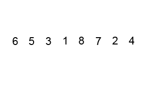
</p>

<br>

### 🔷 Selection Sort

Generally not recommended. Just know there is something like this.

| Stable? | Time     | Space  |
| ------- | -------- | ------ |
| `false` | `O(n^2)` | `O(1)` |

```js
function selectionSort(arr) {
  for (let i = 0; i < arr.length; i++) {
    let min = i;
    for (let j = i + 1; j < arr.length; j++) {
      if (arr[j] < arr[min]) {
        min = j;
      }
    }
    let temp = arr[i];
    arr[i] = arr[min];
    arr[min] = temp;
  }
}

const numbers = [8, 5, 2, 6, 9, 3, 1, 4, 0, 7];

selectionSort(numbers);

console.log(numbers); // [0, 1, 2, 3, 4, 5, 6, 7, 8, 9]
```

<p align="center">
  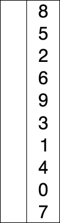
</p>

<br>

### 🔷 Insertion Sort

- Small Datasets:
  > Insertion Sort can be effective for sorting small datasets due to its simplicity and low overhead.
- Real-time Data:
  > Insertion Sort is often used in scenarios where data is being streamed in real-time and needs to be sorted as it arrives.
- Nearly Sorted Data:
  > When the input data is already partially sorted or contains only a few elements out of place, this algorithm can quickly rearrange the data with minimal comparisons and swaps.

| Stable? | Time     | Space  |
| ------- | -------- | ------ |
| `true`  | `O(n^2)` | `O(1)` |

```js
function insertionSort(arr) {
  for (let i = 1; i < arr.length; i++) {
    let j = i - 1;
    while (j >= 0 && arr[j + 1] < arr[j]) {
      let temp = arr[j + 1];
      arr[j + 1] = arr[j];
      arr[j] = temp;

      j--;
    }
  }
}

const numbers = [6, 5, 3, 1, 8, 7, 2, 4];

insertionSort(numbers);

console.log(numbers); // [1, 2, 3, 4, 5, 6, 7, 8]
```

<p align="center">
  
</p>

<br>

### 🔷 Merge Sort

- Large Datasets:
  > Merge Sort's time complexity of `O(n log n)` makes it highly efficient for sorting large datasets.
- Divide and Conquer:
  > Merge Sort follows the divide-and-conquer paradigm, breaking down the sorting task into smaller subproblems, sorting them individually, and then merging the sorted sublists to produce a fully sorted list.
- Predictable Performance:
  > Unlike some other sorting algorithms, Merge Sort consistently performs well regardless of the input data's distribution.
- Parallelization:
  > Merge Sort can be easily parallelized, allowing it to take advantage of multi-core processors and distributed computing environments. This makes it suitable for sorting very large datasets in parallel, further improving its efficiency.

| Stable? | Time          | Space  |
| ------- | ------------- | ------ |
| `true`  | `O(n log(n))` | `O(n)` |

```js
const mergeSort = (array) => {
  // base case:
  if (array.length <= 1) return array;
  // split:
  const mid = Math.floor(array.length / 2);
  const left = array.slice(0, mid);
  const right = array.slice(mid);
  // split until base case and then merge back while unfolding:
  return merge(mergeSort(left), mergeSort(right));
};

// compare and merge:
const merge = (left, right) => {
  const temp = [];
  let l = 0;
  let r = 0;
  while (l < left.length && r < right.length) {
    if (left[l] <= right[r]) {
      temp.push(left[l]);
      l++;
    } else {
      temp.push(right[r]);
      r++;
    }
  }
  return [...temp, ...left.slice(l), ...right.slice(r)];
};

const numbers = [6, 5, 3, 1, 8, 7, 2, 4];

console.log(mergeSort(numbers)); // [1, 2, 3, 4, 5, 6, 7, 8]

console.log(numbers); // [6, 5, 3, 1, 8, 7, 2, 4]
```

<p align="center">
  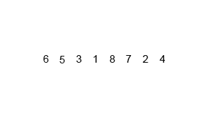
</p>

<br>

### 🔷 Quick Sort

The important thing in Quick Sort is selecting a good pivot element and efficiently partitioning the array around it. A good pivot choice helps balance the sizes of the subarrays, minimizing the number of recursive calls and reducing the overall time complexity.

> The efficiency of Quick Sort heavily depends on the partitioning step, which should ideally split the array into roughly equal-sized partitions to achieve optimal performance.

- Memory Efficient:
  > Quick Sort is an in-place sorting algorithm, meaning it requires only a constant amount of additional memory space beyond the input array.
- Adaptive Sorting:
  > Quick Sort's performance can be further optimized by selecting a good pivot element, which allows it to adapt to the characteristics of the input data.

| Stable? | Time                            | Space       |
| ------- | ------------------------------- | ----------- |
| `false` | `O(n log(n))` (worst: `O(n^2)`) | `O(log(n))` |

```js
const quickSort = (arr, left = 0, right = arr.length - 1) => {
  if (left < right) {
    // pivot: middle element
    const pivot = arr[Math.floor((left + right) / 2)];

    const index = partition(arr, left, right, pivot);

    quickSort(arr, left, index - 1);
    quickSort(arr, index, right);
  }

  return arr;
};

const partition = (arr, left, right, pivot) => {
  while (left <= right) {
    while (arr[left] < pivot) {
      left++;
    }

    while (arr[right] > pivot) {
      right--;
    }

    if (left <= right) {
      let temp = arr[left];
      arr[left] = arr[right];
      arr[right] = temp;

      left++;
      right--;
    }
  }
  return left;
};

const numbers = [2, 4, 7, 1, 0, 0, 5, 4, 8];

quickSort(numbers);

console.log(numbers); // [0, 0, 1, 2, 4, 4, 5, 7, 8]
```

> [!NOTE]
> The worst-case time complexity of Quick Sort is `O(n^2)`, which occurs when the chosen pivot is consistently either the smallest or largest element in the array. In such cases, the partitioning step fails to divide the array into roughly equal-sized partitions, leading to unbalanced recursion and degraded performance.

<p align="right">
    <a href="#data-structures--algorithms">back to top ⬆</a>
</p>

<br>
<br>

## 🔶 Searching

Searching algorithms are methods used to locate specific items within a collection of data.

| Name                 | Time        | Space  |
| -------------------- | ----------- | ------ |
| Linear Search        | `O(n)`      | `O(1)` |
| Binary Search        | `O(log(n))` | `O(1)` |
| Depth First Search   | `O(n)`      | `O(h)` |
| Breadth First Search | `O(n)`      | `O(n)` |

<br>

### 🔷 Linear Search

| Time   | Space  |
| ------ | ------ |
| `O(n)` | `O(1)` |

Checks each element of the list sequentially for the target value until a match is found or all elements have been searched.

```js
const linearSearch = (arr, target) => {
  for (let i = 0; i < arr.length; i++) {
    if (arr[i] === target) {
      return i;
    }
  }
  return -1;
};

const numbers = [9, 1, 7, 3, -4, 0, 3, 5, 6, 5];

const targetIndex = linearSearch(numbers, 5);

console.log(targetIndex); // 7
```
