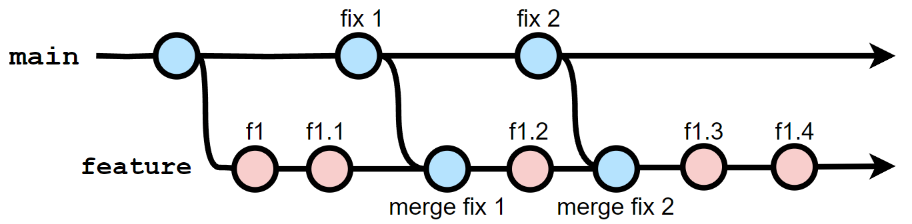
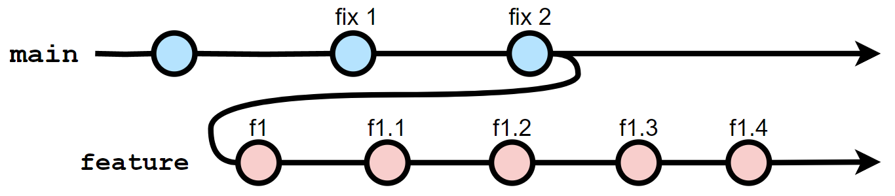
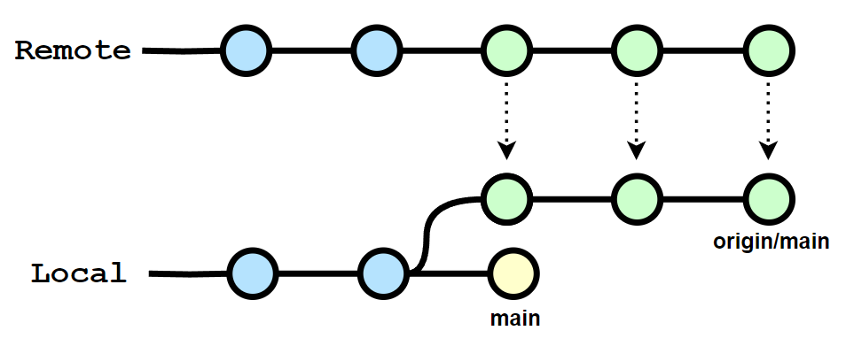
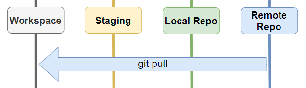

  

<h1 align="center">Git</em></h1>

  Git is the world's most popular version control system that helps teams work together on projects. It tracks changes to files over time, allowing multiple people to collaborate efficiently. And I have tried to cover almost everything about it here.

    <a href="https://github.com/shaanaliyev/tech-stack#tech-stack">Main Page ↖</a>

#### Knowledge requirements

- No previous knowledge is required!
  > But if you are new to Git, I recommend watching [Git Explained in 100 Seconds](https://youtu.be/hwP7WQkmECE) before starting.

### Contents

1. [Configuration](#-configuration)
2. [Basics](#-basics)
   - [Git Areas](#-git-areas)
   - [Core commands](#-core-commands)
3. [Branches](#-branches)
   - [Core branching commands](#-core-branching-commands)
   - [Merging branches](#-merging-branches)
   - [Rebasing](#-rebasing)
4. [Comparing changes](#-comparing-changes)
5. [Stashing](#-stashing)
6. [Time Traveling (undoing changes)](#-time-traveling-undoing-changes)
7. [GitHub](#-github)
   - [Getting Started](#-getting-started)
   - [Setting Up a Remote](#-setting-up-a-remote)
   - [Applying changes](#-applying-changes)

 

## 🔶 Configuration

- Configure the name and email that Git will associate with your work (required before start).
  - `git config --global user.name "[Name]"`
  - `git config --global user.email "[Email]"`
    > (Optional): If you want to keep your email private, you can use the email provided by GitHub. You can find it in your GitHub settings. For example, mine is 35802638+shaanaliyev@users.noreply.github.com.
    > Without the '--global' option, the configuration will be applied locally to the current repository (you need an initialized repository to do this).
- `git init`: Initialize a new Git repository in a directory.
  > When you run this command in a folder, it sets up all the necessary files and directories that Git needs to start tracking changes in your project. _(You need this once per project.)_

    <a href="#git">back to top ⬆</a>

 
 

## 🔶 Basics

### 🔷 Git Areas

Git has three main areas or states for managing changes in a project:

- **Working Directory (Untracked Area)** - 1️⃣
  > This is where you make modifications to your files. It contains all the files and directories of your project. Changes made in this area are considered 'untracked' by Git. Git detects the changes and sees that the working tree is no longer clean, but it does not track the changes. Untracked files are not included in version control and do not become part of Git's history.
- **Staging Area** - 2️⃣
  > This is where you can carefully select and prepare changes before committing them to the repository. By adding files to the staging area, Git tracks them and considers them ready to be committed. This allows you to group related changes together and review modifications before permanently adding them to the repository.
- **Repository (Committed Area)** - 3️⃣
  > This is the final and permanent area for your project's history. When you commit changes from the staging area, Git creates a new snapshot of the project's state and stores it in the repository. Commits in the repository are immutable and represent milestones in the project's timeline. They can be referenced by unique commit hashes, and you can switch between different commits to view the project at different points in time.

Summary:

> 1️⃣ We work on stuff (creating, editing, deleting files, etc.).

> 2️⃣ Add changes (group specific changes together).

> 3️⃣ Commit (commit everything that was previously added).

Ignoring files `.gitignore`:

> The '.gitignore' file is a configuration file in Git that allows you to specify which files and directories should be ignored and not tracked by Git. This is useful for files you know you never want to commit, such as secrets, API keys, credentials, log files, dependencies etc. When you create a '.gitignore' file and list files or patterns inside it, Git will exclude those files from being staged or committed.

> Here are some examples of commonly used patterns:

- > `*.txt` - Ignores all files with the .txt extension.
- > `!important.txt` - Excepts a file named important.txt from being ignored (assuming we use it after `*.txt`).
- > `folderName/` - Ignores the entire directory named folderName.
- > `config.ini` - Ignores a file named config.ini.
- > `build*/` - Ignores all directories starting with build.
- > `/src/**/*.bak` - Ignores all .bak files in any subdirectory under the src directory.

 

### 🔷 Core commands

- `git status`: Show the working tree status.
  > This includes information about the current branch you are on, the changes made to your files and their current status within the repository.
- `git add [File]...`: Add the given new or modified files from the working directory to the staging (index) area. 1️⃣ --> 2️⃣
  - `.` - Stage all changes at once.
- `git commit`: Record grouped changes from the staging area to the repository. 2️⃣ --> 3️⃣

  > It will open an editor for you to enter a multilane commit message. Enter the message you want, then save and exit the editor.

  - `-m '[Message]'` - Shortcut that allows you to enter a single-line commit message directly without opening an editor.

    > You can use this option multiple times to add multiple lines to the commit message. The first line is required and should summarize the changes, while the second and subsequent lines can be used for comments and additional details.

    > It is more common to use the present tense (imperative) for the first line.

  > Keep each commit focused on a single thing. A commit should have only one purpose. This makes it much easier to undo or rollback changes later on. It also makes your project easier to review.

  > You can use the `git commit -am '[Message]'` syntax to perform both the git add and git commit operations at once.

  - `--amend` - Modify / Amend the most recent commit.

    > Let's say you have just made a commit and then realize that you forgot something, such as a typo in a file or including a file itself, or even made a mistake in the commit message. Instead of creating a completely new and separate commit to fix it, you can modify the previous commit using this command.

    > Before using `git commit --amend`, you need to stage your changes using `git add [File]...` for the modifications you want to include in the amended commit if you have any. For typos, you can directly use the command and modify the message.

    > When you use this command, it will open an editor for you to edit the commit message. If you want to edit the commit message, you can make the changes there. Or, you can leave it as it is to not edit and then save and exit to apply the changes.

- `git log`: Show commit logs.
  > It shows a detailed log of commits, including the commit hash, author information, date and time of the commit, and the commit message.
  - > `--oneline` - Show commit logs in a minimized format.
  - > `-[Number]` - Limit the number of commits to output.
  - > `--merge` - Show only the merge commits in the commit history, excluding regular non-merge commits.

    <a href="#git">back to top ⬆</a>

 
 

## 🔶 Branches

In Git, a branch is a lightweight movable pointer to a commit. Branches allow you to isolate changes, work on them independently, and merge them back into the main branch when they are ready. This way, you can develop new features or fix bugs without affecting the stability of the main codebase.

When we initialize a repository in Git, there is always a default branch created.

> Historically, Git commonly used the branch name "master" as the default branch. However, in recent years, there has been a shift towards using "main" as the default branch name to promote more inclusive terminology.

  

What is `HEAD`?

> HEAD is a pointer that refers to the current "location" in your repository, acting like a bookmark. It represents the latest commit in the current branch or a specific commit when in a detached HEAD state.

> It allows you to easily identify the commit that is currently active and serves as the starting point for new commits.

 

### 🔷 Core branching commands

- `git branch`: List, create, rename, or delete branches.

  - ` ` - List the existing branches in your repository. (\*) indicates the branch you are currently on.
  - `[Name]` - Create a new branch with the given name, based upon the current HEAD.
    > This just creates the branch. It does not switch you to that branch.
  - `-d [Name]` - Delete the branch with the given name. It will delete the branch only if it has been merged. Otherwise, it will not delete it.

    > You can use `-D` to forcefully delete the branch, even if it has not been merged.

    > You can't delete the branch you're currently on, you need to switch to a different branch first.

  - `-M [New_Name]` - Rename the branch that you are currently on.

    > You can use `-m [Name] [New_Name]` to rename any branch.

  - `-vv` - Display a list of local branches along with additional information about their upstream branches.
  - `-a` - List both remote-tracking branches and local branches.
  - `-r` - List the remote-tracking branches.

- `git switch`: Switch branches.
  - `[Name]` - Switch to the specified branch.
  - `-c [Name]` - Create a new branch and switch to it.
    > You can use `-C` if the branch already exists, but we want to reset it.
- `git checkout`: Switch branches or restore working tree files.
  - `[Name]` - Switch to the specified branch.
  - `-b [Name]` - Create a new branch and switch to it. > You can use `-B` if the branch already exists, but we want to reset it.
    > When you move between branches, your codebase will be updated accordingly to match that branch you are on.

When you switch branches in Git while having uncommitted changes, the behavior depends on the nature of the changes you have made:

- Changes with no conflicts:
  > Git will try to carry them over to the new branch (the changes come with you). Git will preserve your modifications in your working directory as you switch branches, allowing you to continue working on them.
- Changes with conflicts:
  > Git will prevent the branch switch to avoid data loss and inform you about the conflicts. In this case, you need to decide whether to commit, stash, or discard your changes before switching branches.

 

### 🔷 Merging branches

In Git, merging refers to the process of combining two or more branches together. When you merge branches in Git, the changes made in the source branch are applied to the target branch.

- `git merge [Name]`: Combine changes from the given named branch into the current branch.

  - `--squash` - Combine all the commits from the merged branch and add them to the staged area of the current branch.

    > This allows you to commit everything at once with a single commit, thereby avoiding cluttering your branch history with numerous small, individual commits from the merged branch.

  > If you encounter conflicts or issues while performing a Git merge, you can use `git merge --abort` to cancel the merge and revert your branch to its previous state.

There are two primary types of merges in Git:

- Fast-forward merge:

  > This type of merge occurs when there have been no new commits on the target branch since the source commit was created. In such cases, Git simply moves the pointer of the target branch to the latest commit of the source branch without creating a new merge commit. This process results in a linear commit history. _Ex: (HEAD -> main, dev)_.

  

    
  

  - `git merge --no-ff [Name]` - The `--no-ff` flag forces Git to always create a new merge commit, even if a fast-forward merge could have been performed.
    > This ensures that the history of the merged branch is preserved, and a merge commit is automatically created with the message "Merge branch 'dev'" for example.

- Three-way merge:

  > This type of merge occurs when there are new commits on both branches. Git performs a three-way merge by finding the common ancestor commit and applying the changes introduced in both branches since that point.

  - If there are no conflicts, Git automatically applies the combined changes to the current branch and creates a new merge commit (you are still asked to enter a commit message).

  - If conflicting changes occur, where the same lines of code have been modified differently on both branches, Git stops the merge and asks for manual conflict resolution. In such cases, you need to edit the conflicting files and choose which changes to keep.
    > Step by step scenario:
    - > Conflicts occur (It shows you which files have merge conflicts. The files with merge conflicts are in a special form; they have markers that show the differences between two branches).
    - > Open up the files with merge conflicts.
    - > Edit the files to remove the conflicts and choose which changes to keep. It is up to you how you keep and edit the file.
    - > Remove the conflict 'markers' and save the files.
    - > Stage your changes and then make a commit (that will be your merge commit).

  

    
  

 

### 🔷 Rebasing

- `git rebase [Branch_Name]`: Incorporate the latest changes from the given branch into your current branch.

  > This command essentially replays the commits from your current branch on top of the latest commit in the given branch.

  > If a conflict occurs, you can resolve it manually and choose what to keep. To mark the conflicts as resolved, you need to add the modified files using the command `git add [File]...`. Once you have resolved the conflicts and added the files, you can continue the rebase process by running the command `git rebase --continue`.

  - `--abort` - To abort and get back to the state before "git rebase".

What is it?

> Imagine you have decided to work on a new feature, so you create a new feature branch. While you are working on it, your collaborators complete their tasks, such as bug fixes, and merge their code into the main branch. Now, you want to incorporate those changes into your feature branch because there might be bug fixes that you don't want to work on in a codebase with known issues.

> To obtain those changes, you can merge the main branch into your feature branch. By doing this, you can continue your work with the updated codebase. As you progress with your work, there may be additional bug fixes or other changes in the main branch that you would like to include in your feature branch. In such cases, you can perform another merge.

> However, imagine that the main branch is very active, and this situation occurs 2-3 times a day. If you have to work on your feature branch for a long time, this can result in a messy history filled with numerous meaningless merge commits. Your feature branch might end up with 100 merge commits that do not actually provide any meaningful information about the work you are doing.

> This cluttered history can make it difficult to understand the development process and track the actual changes made in your feature branch. It also makes the commit history less clean and linear.

  

    
  

> To address this issue, Git provides the "git rebase" command, which allows you to reapply your changes on top of the updated main branch instead of creating additional merge commits. It achieves this by identifying the common ancestor commit between the current branch and the branch onto which you want to rebase.

> This way, your feature branch will have a more coherent, meaningful, and linear commit history, making it easier to review, understand, and collaborate with others.

> During a rebase, Git creates new commits by replaying the original commits (feature branch) on top of a different base commit (latest commit from the main branch). As a result, the new commits will have different commit hashes, even if the changes within the commits remain the same.

  

    
  

> **Warning**:
> Rebasing should be avoided in shared or public repositories because it can lead to conflicts when multiple people are working on the same branch. This can make it harder to merge changes and collaborate effectively. Furthermore, once you have pushed the rebased commits, it becomes challenging for others to integrate their work since their commit history no longer matches the repository's history. It's generally recommended to use git rebase on local branches or branches that haven't been pushed yet.

    <a href="#git">back to top ⬆</a>

 
 

## 🔶 Comparing changes

- `git diff`: Show the differences between different versions of files in a Git repository.

  > It displays the changes made to the files, line by line, and provides a clear view of what has been added, modified, or deleted.

  - ` ` - List the changes made between the unstaged area (1️⃣) and the staged area (2️⃣).
  - `HEAD` - List all changes in the working tree since the last commit (3️⃣), including both staged (2️⃣) and unstaged (1️⃣) changes.
  - `--staged` - List the changes between the staged area (2️⃣) and the last commit (3️⃣).

    > In other words, it shows what will be included in your commit if you run 'git commit' right now.

    > `--cached` does the same thing.

  - `[Branch1]..[Branch2]` - List the changes between two branches.
  - `[Commit_Hash1]..[Commit_Hash2]` - List the changes between two commits.
    > We can view the changes within a specific file by providing a file name after any of these options. `git diff HEAD [File]...`.

    <a href="#git">back to top ⬆</a>

 
 

## 🔶 Stashing

Stashing is a feature that allows you to temporarily save changes in your working directory that are not ready to be committed yet.

> Stashing is useful in situations where you need to switch to a different branch to work on something else, but you don't want to commit your current changes or lose them. It allows you to save your changes, switch branches, and then later come back to your original branch and apply the saved changes.

- `git stash`: Save changes that have not yet been committed (unstaged & staged).

  - ` ` - Save changes to the stash.

    > Running this command will revert the changes you have made since the last commit. This means that the changes will not be carried over when you switch branches (the changes will not come with you).

    > You can add muptiple stashes onto the stash list.

    > When you stash, it assigns an index, branch, and message information to that stash. The most recent stash added always has index 0, the second has index 1, and so on.

  - `push -m '[Message]'` - Save changes to the stash with a specific message.
  - `list` - Show the stash list.
  - `pop` - Apply the most recently stashed changes to your working copy <ins>and remove</ins> them from the stash list.
    - > `[Index_No]` - Apply a specific stash.
  - `apply` - Apply the most recenly stashed changes to your working <ins>without removing</ins> it from the stash list.

    - > `[Index_No]` - Apply a specific stash.
      > This can be useful if you want to apply stashed changes to multiple branches.

    > If a conflict occurs, you can resolve it using the same method as we do in merging.

  - `clear` - Clear the entire stash list.
  - `drop [Index_No]` - Remove a specific stash from the list.

    <a href="#git">back to top ⬆</a>

 
 

## 🔶 Time Traveling (undoing changes)

- `git checkout [Commit_Hash]`: Travel to a specific commit.

  - > `HEAD~[Number]` - A different syntax to do the same thing.
    > `~1` refers to the commit before HEAD. `~2` refers to 2 commits before HEAD and so on. _Ex: `git checkout HEAD~3` means three commits before the current HEAD._

  > You will travel to the state of the given commit, and everything will be as it was at that moment (the given commit included).

  > This puts your repository in a detached HEAD state.

  > The files in your working directory are replaced with the contents of the commit you checked out.

  What you can do here?

  - > Look around, view files, and when you're done, simply switch back to the branch you were on before to go back to where you were. _Ex: `git switch main`_. Alternatively, you can use a special syntax to switch directly to the exact branch where you were previously with `git  switch -`.
  - > Create a new branch from the detached HEAD and switch to it. Now the changes will be saved since the HEAD is no longer detached, and you can build upon this state. This new branch will represent a distinct version that is based on a specific commit, disregarding any subsequent commits that came after it.

  What is `detached HEAD` state?

  > In Git, the "detached HEAD" state occurs when the HEAD pointer is directly pointing to a specific commit rather than a branch reference (latest commit of current branch). This can happen when you check out a specific commit, a tag, or a branch that is not up to date. While in a detached HEAD state, you can still look around, make changes and create commits, but these commits won't belong to any branch and can be easily lost.

- `git restore --source [Commit_Hash] [File]...`: Restore the contents of the given files to their state from the given commit (including).

  > It simply adds the "Commit_Hash" state of the given files as unstaged changes; there will not be any time travel.

   

**Moving between areas:**

- `git restore [File]...`: Discard unstaged changes. 1️⃣ --> 0️⃣

  > The old command to do the same thing: `git checkout [File]...`.

- `git clean [-Options]...`: Clean up untracked files and folder in a Git repository.

  - `-d` - Remove untracked files and folders.
  - `-f` - To perform the clean operation forcefully.
  - `-n` - Preview what would be removed if the command were executed.

- `git checkout HEAD [File]...`: Discard uncommitted changes. 1️⃣, 2️⃣ --> 0️⃣

  > Any changes made to those files since the last commit will be discarded, and the files will be reverted to their previous state (staged area will be cleared).

- `git restore --stage [File]...`: Unstage files. 2️⃣ --> 1️⃣

  > When you accidentally add a file to the staging area using "git add [File]...", you can use this command to undo it.

  > `git reset [File]...` does the same thing as well.

- `git reset [--Options] [Commit_Hash]`: Rewind the repository to the specified commit (including).

  - ` ` - Jump to a specific commit and discard all the commits that come after it. 3️⃣ --> 1️⃣

    > All the changes that were made before using this command will be kept in the working directory as unstaged changes.

  - `--hard` - Does the same thing with ` `, but this time the changes will also be discarded. 3️⃣ --> 0️⃣

  - `--soft` - Does the same thing with ` `, but this time the changes will move to the staged area, not the unstaged area. 3️⃣ --> 2️⃣

- `git revert [Commit_Hash]`: Create a new commit that undoes the changes made in the specified commit.

  > The new commit will have the changes made before the specified commit.

  > You may be asked to resolve conflicts.

  > It is useful when working with a team as it enables collaboration by allowing everyone to easily see and understand the changes that have been undone. It maintains a clear record of the project's history and helps avoid conflicts when multiple people are making changes simultaneously.

> **Note**:
> Instead of using `[File]...` in the mentioned locations within this section, you can use `.` to cover everything. Additionally, instead of using `[Commit_Hash]`, you can also use the `HEAD~[Number]` syntax.

    <a href="#git">back to top ⬆</a>

 
 

## 🔶 GitHub

GitHub is a web-based platform that provides a centralized location for hosting and collaborating on software development projects using the Git version control system.

> **Note**:
> You can apply what is shown here to other remote repository hosting platforms as well; in general, they operate under the same logic.

 

### 🔷 Getting Started

**To get a GitHub repository to your local machine.**

- `git clone [Remote_URL]`: Create a local copy of a repository hosted on GitHub.

  > It is not necessary to own the repository you want to clone.

  > When you run git clone, Git downloads all files, version history, branches, and tags, creating a complete local copy of the repository.

  > By default, only the default branch will be available in the local branch form. Other branches will be accessible only as remote tracking branches.

  > You can use the command `git branch -r` to see all the available remote tracking branches in the repository.

  > To work on one of these branches, you need to create a local branch based on the corresponding remote tracking branch using the `git switch [Branch_Name]` command.

  > If you want to clone the repository into the current directory, without creating a new subdirectory for it, you can append `.` to the git clone command.

 

**To get a local repository on GitHub.**

- Starting from Scratch:

  > If you haven't begun work on your local repo.

  - Create a new repository on GitHub.
  - Create a local copy of it by cloning.
  - Do your work locally.
  - Push your changes up to GitHub.

- Existing Repository:

  > If you already have an existing repository locally that you want to get on GitHub.

  - Create a new repository on GitHub.
  - Connect your local repository with the remote GitHub repository.
  - Push your changes up to GitHub.

 

### 🔷 Setting Up a Remote

Prior to uploading any content to GitHub, it is necessary for us to inform Git about the existence of our remote repository on GitHub.

> If you clone a GitHub repository, you don't need to manually set up the remote repository in Git. The cloning process automatically establishes the remote repository as the default origin.

- `git remote`: Manage the remote repositories.

  - `-v` - Display the remote repositories associated with your local Git repository.
  - `add [Remote_Name] [Remote_URL]` - Add a new remote repository to your local Git repository.
    > We are simply instructing Git to remember the Remote Repository URL using the name we have provided, and it's a convention to use "origin" as the default name. However, you can choose any name that makes sense to you.
  - `rename [Remote_Name] [New_Remote_Name]` - Rename remote.
  - `remove [Remote_Name]` - Remove remote.

- `git push [Remote_Name] [Branch_Name]`: Upload your local changes to a remote repository.

  > If there is no branch with the given name on the remote repository, Git will create a new branch with that name on the remote repository.

  > Git also sets up a relationship between your local branch and the remote branch. This relationship is called a remote tracking branch. The remote tracking branch keeps track of the state of the corresponding branch on the remote repository.

  - `-u` - Set an upstream (tracking) reference for a branch.

    > Once you have set up the upstream reference, you can use `git pull` and `git push` without explicitly specifying the remote and branch names. Git will automatically know which remote repository and branch to use based on the established tracking relationship.

  > We can also push a local branch to a differently named remote branch by using the `git push [Remote_Name] [Local_Branch]:[Remote_Branch]` syntax.

    

 

**Remote tracking branch.**

Remote tracking branches serve as a connection between the local branch and the remote branch in Git. They function as a local copy of the remote branch and serve two main purposes:

- Tracking the state of a branch on the remote repository:

  > Remote tracking branches provide information about the last known state of the remote branch, such as the commit history and the latest commit. This allows you to see the state of branches on the remote repository without directly interacting with it. It helps in syncing your local repository with the remote repository and staying up to date with changes made by others.

- Facilitating collaboration and synchronization:

  > Remote tracking branches enable you to collaborate with others by fetching and pushing changes to and from the remote repository. <ins>**When you fetch changes from the remote repository, Git updates the remote tracking branches to reflect the latest state of the remote branches.**</ins> You can then compare the changes in the remote tracking branches with your local branches to merge or rebase your work.

> You can also checkout to a remote tracking branch, which will put you in a 'detached HEAD' state. In this state, you can perform the same actions we discussed earlier regarding the 'detached HEAD' state.

What happens to the remote tracking branch if you do some work (add commits) on the local branch?

> When you perform work and make commits on a local branch that is tracking a remote branch, the remote tracking branch does not change/update itself automatically. They can diverge, and that is totally fine. That is the point of this tracking reference, so that you know how far ahead you are.

What happens if someone adds commits to a remote branch while you have a local branch tracking that remote branch?

> It does not automatically update itself when new commits are added to the remote branch. To incorporate the new commits from the remote branch into your local tracking branch, you need to perform a git fetch or git pull operation.

- `git ls-remote`: List all references (branches, tags, or other references) available in a remote repository.

- `git fetch [Remote_Name]`: Update remote tracking branches.

  > It retrieves any new commits or changes from the specified remote repository without merging them into your current branch. This allows you to have an up-to-date view of the remote repository without modifying your current branch.

  > It updates all remote tracking branches in your local repository that correspond to branches in the remote repository. If there are new branches in the remote repository, it also retrieves them.

  > You can use `git fetch [Remote_Name] [Branch_Name]` to fetch a specific branch from the remote repository instead of fetching all branches.

  

    
  

  

    
  

> When you run `git status` with a remote set up and remote tracking branches configured, Git checks the status of your local branches in relation to their corresponding remote tracking branches. It does not directly check the status of the remote branches on the remote repository.

 

### 🔷 Applying changes

**Updating remote branches.**

`git push`: Upload your local changes to a remote repository.

> To update the remote tracking branch and reflect your local changes on the remote repository, you need to push your local branch to the remote repository. This operation sends your new commits to the remote repository and updates the remote branch accordingly. However, there may be some situations:

- Remote has no changes:

  > If the remote branch has not been modified by someone else since you last fetched or pulled, your push operation will be successful, and the remote tracking branch will be updated to match the new state of the remote branch.

- Remote has changes:

  > If the remote branch has been modified by someone else in the meantime, Git will reject your push, indicating that the remote branch has diverged from your local branch. In this case, you will need to update you local branch with the latest changes from the remote repository. Or you can forcefully push by adding the `-f` option (not recommended because it overwrites the remote branch, potentially discarding other people's work).

  - `git pull [Remote_Name] [Branch_Name]` - Update local branch with the latest changes from a remote repository.

    > `git pill` is just a combination of `git fetch` and `git merge`. When you run git pull, Git first performs a git fetch operation. It updates the corresponding remote tracking branch in your local repository to reflect the state of the remote repository. Then Git automatically merges the retrieved changes from the remote tracking branch into your current branch you are on.

    > However, if there are conflicts between the changes in your current branch and the changes from the remote tracking branch, Git will pause the process and prompt you to resolve the conflicts manually. Once the conflicts are resolved, you can complete the merge by committing the changes. Then you can push the changes again.

    

      
    

    > You can use `git pull` without specifying a particular remote or branch. When you do that, Git assumes the following defaults:

    - > Git assumes the remote to be the default remote repository, which is typically named 'origin'.
    - > Git assumes the branch to be the current branch you are on and uses the configured tracking branch for that branch.

    <a href="#git">back to top ⬆</a>

