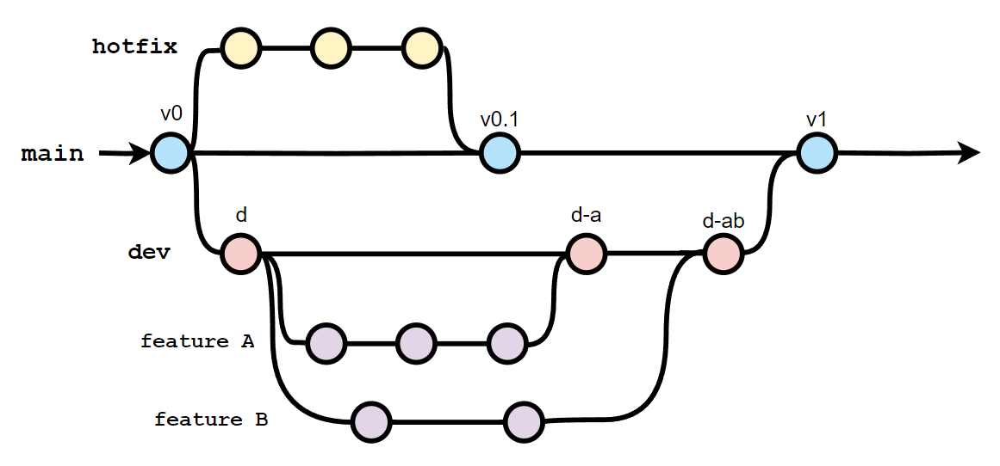
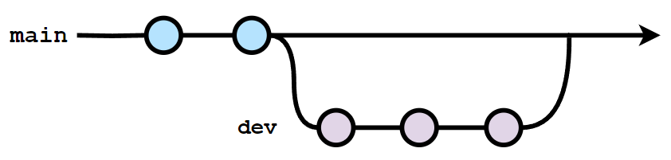
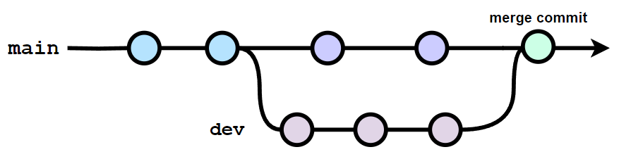

  

<h1 align="center">Git</em></h1>

  Git is the world's most popular version control system that helps teams work together on projects. It tracks changes to files over time, allowing multiple people to collaborate efficiently. And I have tried to cover almost everything about it here.

    <a href="https://github.com/shaanaliyev/tech-stack#tech-stack">Main Page ↖</a>

#### Knowledge requirements

- No previous knowledge is required!
  > But if you are new to Git, I recommend watching [Git Explained in 100 Seconds](https://youtu.be/hwP7WQkmECE) before starting.

### Contents

1. [Configuration](#-configuration)
2. [Basics](#-basics)
   - [Git Areas](#-git-areas)
   - [Core commands](#-core-commands)
3. [Branches](#-branches)
   - [Core branching commands](#-core-branching-commands)
   - [Merging branches](#-merging-branches)
4. [Comparing changes](#-comparing-changes)

 

## 🔶 Configuration

- Configure the name and email that Git will associate with your work (required before start).
  - `git config --global user.name "[Name]"`
  - `git config --global user.email "[Email]"`
    > (Optional): If you want to keep your email private, you can use the email provided by GitHub. You can find it in your GitHub settings. For example, mine is 35802638+shaanaliyev@users.noreply.github.com.
    > Without the '--global' option, the configuration will be applied locally to the current repository (you need an initialized repository to do this).
- `git init`: Initialize a new Git repository in a directory.
  > When you run this command in a folder, it sets up all the necessary files and directories that Git needs to start tracking changes in your project. _(You need this once per project.)_

    <a href="#git">back to top ⬆</a>

 
 

## 🔶 Basics

### 🔷 Git Areas

Git has three main areas or states for managing changes in a project:

- **Working Directory (Untracked Area)** - 1️⃣
  > This is where you make modifications to your files. It contains all the files and directories of your project. Changes made in this area are considered 'untracked' by Git. Git detects the changes and sees that the working tree is no longer clean, but it does not track the changes. Untracked files are not included in version control and do not become part of Git's history.
- **Staging Area** - 2️⃣
  > This is where you can carefully select and prepare changes before committing them to the repository. By adding files to the staging area, Git tracks them and considers them ready to be committed. This allows you to group related changes together and review modifications before permanently adding them to the repository.
- **Repository (Committed Area)** - 3️⃣
  > This is the final and permanent area for your project's history. When you commit changes from the staging area, Git creates a new snapshot of the project's state and stores it in the repository. Commits in the repository are immutable and represent milestones in the project's timeline. They can be referenced by unique commit hashes, and you can switch between different commits to view the project at different points in time.

Summary:

> 1️⃣ We work on stuff (creating, editing, deleting files, etc.).

> 2️⃣ Add changes (group specific changes together).

> 3️⃣ Commit (commit everything that was previously added).

Ignoring files `.gitignore`:

> The '.gitignore' file is a configuration file in Git that allows you to specify which files and directories should be ignored and not tracked by Git. This is useful for files you know you never want to commit, such as secrets, API keys, credentials, log files, dependencies etc. When you create a '.gitignore' file and list files or patterns inside it, Git will exclude those files from being staged or committed.

> Here are some examples of commonly used patterns:

- > `*.txt` - Ignores all files with the .txt extension.
- > `!important.txt` - Excepts a file named important.txt from being ignored (assuming we use it after `*.txt`).
- > `folderName/` - Ignores the entire directory named folderName.
- > `config.ini` - Ignores a file named config.ini.
- > `build*/` - Ignores all directories starting with build.
- > `/src/**/*.bak` - Ignores all .bak files in any subdirectory under the src directory.

 

### 🔷 Core commands

- `git status`: Show the working tree status.
  > This includes information about the current branch you are on, the changes made to your files and their current status within the repository.
- `git add [File]...`: Add the given new or modified files from the working directory to the staging (index) area. 1️⃣ --> 2️⃣
  - `.` - Stage all changes at once.
- `git commit`: Record grouped changes from the staging area to the repository. 2️⃣ --> 3️⃣

  > It will open an editor for you to enter a multilane commit message. Enter the message you want, then save and exit the editor.

  - `-m '[Message]'` - Shortcut that allows you to enter a single-line commit message directly without opening an editor.

    > You can use this option multiple times to add multiple lines to the commit message. The first line is required and should summarize the changes, while the second and subsequent lines can be used for comments and additional details.

    > It is more common to use the present tense (imperative) for the first line.

  > Keep each commit focused on a single thing. A commit should have only one purpose. This makes it much easier to undo or rollback changes later on. It also makes your project easier to review.

  - `--amend` - Modify / Amend the most recent commit.

    > Let's say you have just made a commit and then realize that you forgot something, such as a typo in a file or including a file itself, or even made a mistake in the commit message. Instead of creating a completely new and separate commit to fix it, you can modify the previous commit using this command.

    > Before using `git commit --amend`, you need to stage your changes using `git add [File]...` for the modifications you want to include in the amended commit if you have any. For typos, you can directly use the command and modify the message.

    > When you use this command, it will open an editor for you to edit the commit message. If you want to edit the commit message, you can make the changes there. Or, you can leave it as it is to not edit and then save and exit to apply the changes.

- `git log`: Show commit logs.
  > It shows a detailed log of commits, including the commit hash, author information, date and time of the commit, and the commit message.
  - > `--oneline` - Show commit logs in a minimized format.
  - > `-[Number]` - Limit the number of commits to output.
  - > `--merge` - Show only the merge commits in the commit history, excluding regular non-merge commits.

    <a href="#git">back to top ⬆</a>

 
 

## 🔶 Branches

In Git, a branch is a lightweight movable pointer to a commit. Branches allow you to isolate changes, work on them independently, and merge them back into the main branch when they are ready. This way, you can develop new features or fix bugs without affecting the stability of the main codebase.

When we initialize a repository in Git, there is always a default branch created.

> Historically, Git commonly used the branch name "master" as the default branch. However, in recent years, there has been a shift towards using "main" as the default branch name to promote more inclusive terminology.

  

What is `HEAD`?

> HEAD is a pointer that refers to the current "location" in your repository, acting like a bookmark. It represents the latest commit in the current branch or a specific commit when in a detached HEAD state.

> It allows you to easily identify the commit that is currently active and serves as the starting point for new commits.

 

### 🔷 Core branching commands

- `git branch`: List, create, rename, or delete branches.

  - ` ` - List the existing branches in your repository. (\*) indicates the branch you are currently on.
  - `[Name]` - Create a new branch with the given name, based upon the current HEAD.
    > This just creates the branch. It does not switch you to that branch.
  - `-d [Name]` - Delete the branch with the given name. It will delete the branch only if it has been merged. Otherwise, it will not delete it.

    > You can use `-D` to forcefully delete the branch, even if it has not been merged.

    > You can't delete the branch you're currently on, you need to switch to a different branch first.

  - `-M [New_Name]` - Rename the branch that you are currently on.
    > You can use `-m [Name] [New_Name]` to rename any branch.

- `git switch`: Switch branches.
  - `[Name]` - Switch to the specified branch.
  - `-c [Name]` - Create a new branch and switch to it.
    > You can use `-C` if the branch already exists, but we want to reset it.
- `git checkout`: Switch branches or restore working tree files.
  - `[Name]` - Switch to the specified branch.
  - `-b [Name]` - Create a new branch and switch to it. > You can use `-B` if the branch already exists, but we want to reset it.
    > When you move between branches, your codebase will be updated accordingly to match that branch you are on.

When you switch branches in Git while having uncommitted changes, the behavior depends on the nature of the changes you have made:

- Changes with no conflicts:
  > Git will try to carry them over to the new branch (the changes come with you). Git will preserve your modifications in your working directory as you switch branches, allowing you to continue working on them.
- Changes with conflicts:
  > Git will prevent the branch switch to avoid data loss and inform you about the conflicts. In this case, you need to decide whether to commit, stash, or discard your changes before switching branches.

 

### 🔷 Merging branches

In Git, merging refers to the process of combining two or more branches together. When you merge branches in Git, the changes made in the source branch are applied to the target branch.

- `git merge [Name]`: Combine changes from the given named branch into the current branch.
  > If you encounter conflicts or issues while performing a Git merge, you can use `git merge --abort` to cancel the merge and revert your branch to its previous state.

There are two primary types of merges in Git:

- Fast-forward merge:

  > This type of merge occurs when there have been no new commits on the target branch since the source commit was created. In such cases, Git simply moves the pointer of the target branch to the latest commit of the source branch without creating a new merge commit. This process results in a linear commit history.

  

    
  

- Three-way merge:

  > This type of merge occurs when there are new commits on both branches. Git performs a three-way merge by finding the common ancestor commit and applying the changes introduced in both branches since that point.

  - If there are no conflicts, Git automatically applies the combined changes to the current branch and creates a new merge commit (you are still asked to enter a commit message).

  - If conflicting changes occur, where the same lines of code have been modified differently on both branches, Git stops the merge and asks for manual conflict resolution. In such cases, you need to edit the conflicting files and choose which changes to keep.
    > Step by step scenario:
    - > Conflicts occur (It shows you which files have merge conflicts. The files with merge conflicts are in a special form; they have markers that show the differences between two branches).
    - > Open up the files with merge conflicts.
    - > Edit the files to remove the conflicts and choose which changes to keep. It is up to you how you keep and edit the file.
    - > Remove the conflict 'markers' and save the files.
    - > Stage your changes and then make a commit (that will be your merge commit).

  

    
  

    <a href="#git">back to top ⬆</a>

 
 

## 🔶 Comparing changes

- `git diff`: Show the differences between different versions of files in a Git repository.

  > It displays the changes made to the files, line by line, and provides a clear view of what has been added, modified, or deleted.

  - ` ` - List the changes made between the unstaged area (1️⃣) and the staged area (2️⃣).
  - `HEAD` - List all changes in the working tree since the last commit (3️⃣), including both staged (2️⃣) and unstaged (1️⃣) changes.
  - `--staged` - List the changes between the staged area (2️⃣) and the last commit (3️⃣).

    > In other words, it shows what will be included in your commit if you run 'git commit' right now.

    > `--cached` does the same thing.

  - `[Branch1]..[Branch2]` - List the changes between two branches.
  - `[Commit_Hash1]..[Commit_Hash2]` - List the changes between two commits.
    > We can view the changes within a specific file by providing a file name after any of these options. `git diff HEAD [File]...`.

    <a href="#git">back to top ⬆</a>

 
 
