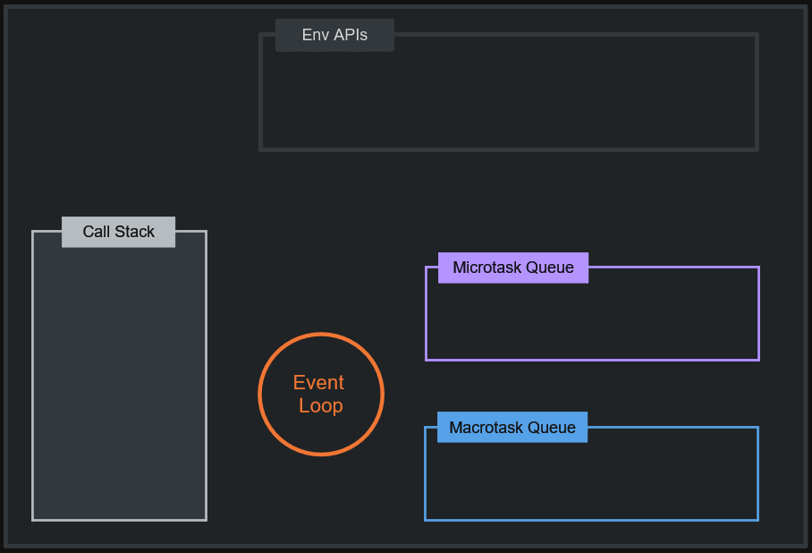
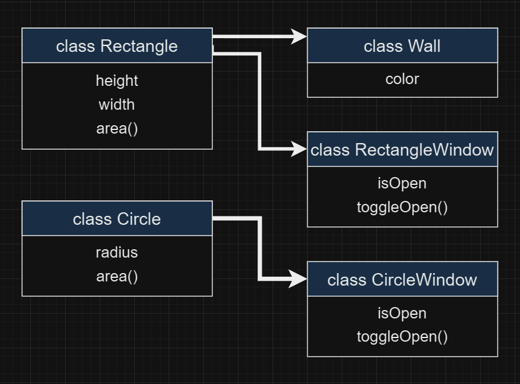
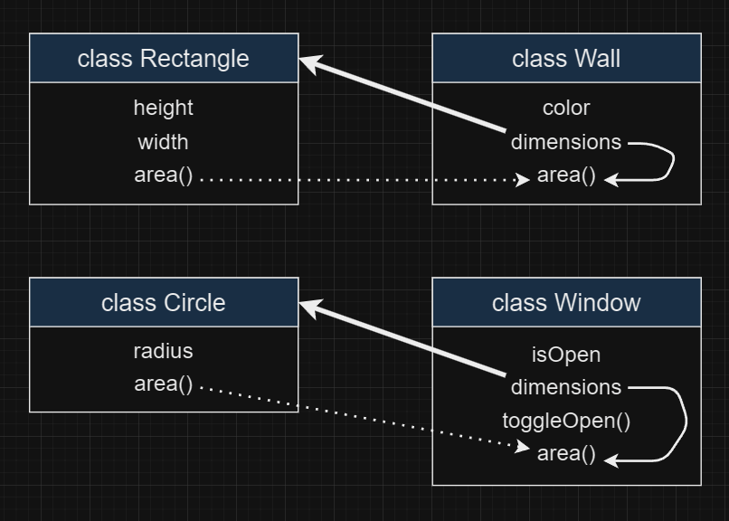

<p align="center">
  
</p>

<h1 align="center">JavaScript</h1>

<p align="center">
  Pure pain.
</p>

<p align="right">
    <a href="https://github.com/seabeya/tech-stack#tech-stack">Main Page ↖</a>
</p>

#### Knowledge requirements

- Basic knowledge of JavaScript syntax is required.

### Contents

1. [How JS Works?](#-how-js-works)
   - [Code Execution](#-code-execution)
   - [Async JavaScript](#-async-javascript)
2. [Core JS concepts](#-core-js-concepts)
   - [Hoisting](#-hoisting)
   - [Block Scope](#-block-scope)
   - [Function Scope](#-function-scope)
   - [Closures](#-closures)
   - [Promises](#-promises)
3. [JS Basics](#-js-basics)
   - [Expressions and Operators](#-expressions-and-operators)
   - [Functions](#-functions)
   - ['this' keyword](#-this-keyword)
   - ['call', 'apply', and 'bind'](#-call-apply-and-bind)
4. [Classes in JS](#-classes-in-js)
   - [Methods](#-methods)
   - [Constructor Method](#-constructor-method)
   - [Inheritance](#-inheritance)
     - [Method overriding](#-method-overriding)
     - [Inheritance vs Composition](#-inheritance-vs-composition)
   - [Private properties](#-private-properties)
   - [Getters and Setters](#-getters-and-setters)
   - [Static Methods](#-static-methods)

<br>

> [!NOTE]
> This is not a comprehensive JavaScript course, which means it doesn't cover every topic in JavaScript. However, I will be providing you with some resources to learn the parts that haven't been mentioned.
>
> - [Resources](#-resources)

<br>

<hr>

## 🔶 How JS Works?

JavaScript (JS) is a programming language that runs on a combination of a JavaScript engine and a runtime environment.

- JS Engine: is a program or a virtual machine that interprets and executes JavaScript code.
  > It takes in the JavaScript source code, parses it, and converts it into executable instructions that can be understood by the computer's hardware. The engine handles tasks such as lexical analysis, syntax parsing, bytecode generation or just-in-time (JIT) compilation, and execution of the JavaScript code. V8 is the most popular JavaScript engine, used in Google Chrome and Node.js.
- Runtime Environment: provides the necessary libraries, APIs, and tools for executing JavaScript code.
  > It provides a set of pre-defined objects and functions that JavaScript code can use to interact with the environment it's running on.

<br>

### 🔷 Code Execution

A JavaScript engine typically has two important components when it comes to code execution:

- `Memory Heap`: This is where dynamic memory allocation occurs.
  > It's responsible for allocating and managing memory for objects, variables, function references, and other data structures created during the program's runtime. Objects and data remain in the heap until they are no longer needed (garbage collection) or explicitly deallocated.
- `Call Stack`: It keeps track of the order in which functions are called.

  - > When a function is invoked, a new EC is created for that function.
  - > This EC is pushed onto the call stack.
  - > The JavaScript engine executes the code within that EC's code execution phase.

  > The call stack operates on a last-in, first-out (LIFO) principle, meaning that the most recently pushed execution context is the first one to be executed and popped off.

  > As functions are nested, their associated ECs get pushed onto the call stack, forming a nested structure that reflects the function call hierarchy.

<br>

When you run a JavaScript program, these phases occur one after another:

1. When a JavaScript program starts, the engine creates the Global Execution Context (GEC).
   > It serves as the foundation for the entire program's code execution.
2. Creation Phase.
   > This phase happens before any actual code execution.
   >
   > JavaScript goes through the entire program line by line, allocating memory for variables and functions encountered.
   >
   > Variables are initialized with `undefined` to indicate they haven't been assigned a value yet.
   >
   > Function definitions (body) are stored entirely (as executable code) in memory during this phase.
3. Code Execution Phase.
   > JavaScript goes through the program again, line by line, this time executing the code.
   >
   > This is where variables are assigned values, expressions are evaluated, and statements are carried out.

<br>

> Example:
>
> ```js
> const n = 10;
> function square(num) {
>   const result = num * num;
>   return result;
> }
>
> let myVar1 = square(n);
> let myVar2 = square(4);
> ```
>
> 1. GEC created.
> 2. Creation Phase:
>    1. `n: undefined`
>    2. `square: { ... }`
>    3. `myVar1: undefined`
>    4. `myVar2: undefined`
> 3. Code Execution Phase:
>    1. `n: 10`
>       > The value `10` is assigned to the previously allocated memory for `n`.
>    2. We skip over the function declaration for `square`.
>       > As it's already processed during creation. There is nothing to do with it in this phase.
>    3. We invoke/execute the function `square(10)`.
>       > When we invoke a function, a brand-new Execution Context (EC) is created for it under the GEC, and the following phases are applied:
>       - Creation Phase:
>         1. `num: undefined` (the parameter)
>         2. `result: undefined`
>         3. There is no action required for the Return statement in the Creation Phase, so we skip over it.
>       - Code Execution Phase:
>         1. `num: 10`
>            > The value of `n` (which is `10`) is passed as an argument and assigned to the parameter `num`.
>         2. `result: 100`
>            > The code `num * num` is executed, and the result (`100`) is assigned to the result variable.
>         3. `myVar1: 100`
>            > The Return statement indicates that the function has completed and returns control to the point where the function was invoked.
>            >
>            > When the function returns, it assigns the returned value: `myVar1: 100`.
>    4. The same invocation/execution process is repeated when `square(4)` is called.
>       > This time, `num` receives the value `4`, leading to `myVar2` being assigned `16`.

<br>

The call stack view of this process:

> 1. The program starts.
> 2. A Global Execution Context (GEC) is created.
> 3. The code starts running step by step, from top to bottom.
> 4. A function call `square(10)` is encountered, and a new Execution Context (E1) is created for executing the function.
> 5. Execution of `square(10)` is completed, and E1 is deleted.
> 6. Another function call `square(4)` is encountered, and a new Execution Context (E2) is created for executing the function.
> 7. Execution of `square(4)` is completed, and E2 is deleted.
> 8. The GEC is deleted from the Call Stack since there is nothing else to execute.
> 9. The program stops.

> [!IMPORTANT]
> When a function is called, its execution context is pushed onto the call stack. The call stack operates on a last-in, first-out (LIFO) principle, which implies that JavaScript executes code sequentially, following a specific order of execution. While the function is being executed, no other code can be executed until the function completes and its execution context is popped off the call stack. This behavior indicates that **JavaScript processes code in a single-threaded manner**, as it can only handle one task at a time.

<br>

### 🔷 Async JavaScript

As you can see by now, we know that the Call Stack has one job: to execute what it receives directly, frame by frame, as a stack (first in, last out). It runs the code synchronously, not asynchronously. But how does JavaScript get its asynchronous power? The answer is: **Environment APIs**.

Environment APIs are part of the JavaScript runtime environment (e.g., web browser or Node.js) and provide functionalities beyond the core language features.

> These APIs allow JavaScript to interact with the environment outside of the Call Stack, such as making HTTP requests, setting timers, or manipulating the Document Object Model (DOM). When JavaScript code invokes these APIs, it essentially orders or requests certain actions to be performed.

> The JavaScript runtime environment handles these requests and delegates the work to the appropriate parts of the system. For example, when making an HTTP request, the runtime environment interacts with the networking subsystem of the operating system or uses browser APIs to initiate the request and handle the response.

> Here are some examples of environment APIs in JavaScript: `setTimeout`, `setInterval`, `fetch`, `localStorage`, `sessionStorage`, `Geolocation`, etc.

<br>

Important definitions:

- Callbacks:
  > A callback in JavaScript is a function passed as an argument to another function, which is invoked later, often asynchronously or in response to an event. It allows for handling asynchronous operations by executing code when a certain task is completed or an event occurs.
- Execution Queues (Task Queues):
  > Execution Queues are first-in, first-out (FIFO) data structures that hold callback functions fired by async APIs.
  >
  > When you use an asynchronous API, the JavaScript engine doesn't wait for it to finish. Instead, it registers/schedules a callback function (using the call stack) to be placed in an appropriate queue (depending on the trigger) and continues executing synchronous code on the call stack.
  >
  > When an asynchronous operation/task completes, the operator gets triggered, and its corresponding callback function is placed in one of the queues.
  >
  > > A registered callback function can be triggered in the following ways: `addEventListener` click event (button click), `setTimeout` expiration of a specified time interval, `fetch('url')` obtaining a response from an endpoint, etc.
- Event Loop:
  > The Event Loop is a fundamental concept in JavaScript that is responsible for managing the execution of asynchronous operations. It's a never-ending loop that constantly checks for things to do.
  >
  > The event loop constantly monitors the call stack and queues. Once the call stack becomes empty (meaning all synchronous code has finished), the event loop pulls the next callback function from the appropriate queue (considering their execution order) and pushes it onto the call stack for execution.

> [!NOTE]
> Synchronous code does not enter any queue before the call stack. Synchronous code executes directly on the call stack.

<br>

#### 🔻 Execution queues and their priorities

> [!IMPORTANT]
> Execution queues have priorities over each other. That means one type of queue should wait for a different type of queue to empty completely if it has lower priority compared to it.

1. Microtask Queues.
   > Higher Priority.
   - > The callback functions triggered by `process.nextTick()` sit inside this queue.
   - > The callback functions triggered by Promises. Ex, `.then()`, `.catch()`.
   - > `MutationObserver` callbacks when changes are detected in the DOM.
2. Macrotask Queues (Callback Queues / Message Queues).
   > Lower Priority.
   - > The callback functions triggered by either `setTimeout()` or `setInterval()`.
   - > User interface events (clicks, key presses).
   - > I/O operations (network requests, file system access).

<br>

**The mechanism:**

<p align="center">
 
</p>

Examples:

> #1:
>
> ```js
> console.log(1);
>
> setTimeout(function cb() {
>   console.log(2);
> }, 3000);
>
> console.log(3);
> ```
>
> Output:
>
> ```sh
> 1
> 3
> 2
> ```
>
> Steps:
>
> 1. `console.log(1)`
>    > - is pushed onto the call stack.
>    > - it is sync.
>    > - executed directly (deleted from the call stack).
>    > - logs `1` to the console.
> 2. `setTimeout(function cb() {console.log(2); }, 3000);`
>    > - is pushed onto the call stack.
>    > - it is async (uses the timer API).
>    > - the timer API registers/schedules the function to be pushed to the queue after 3000 milliseconds (deleted from the call stack).
>    > - the env API does its job in the background (timer starts).
> 3. `console.log(3)`
>    > - is pushed onto the call stack.
>    > - it is sync.
>    > - executed directly (deleted from the call stack).
>    > - logs `3` to the console.
> 4. Once the async operation (timer) completes, the timer API pushes the callback function into the macro task queue.
>
> > Meanwhile, the event loop continuously checks if the call stack is empty (which it is).
>
> 5. The event loop takes the callback function from the queue and loads it into the call stack.
> 6. `console.log(2);`
>    > - it is synchronous.
>    > - executed directly (deleted from the call stack).
> 7. Done!

<br>

> #2:
>
> ```js
> Promise.resolve().then(() => {
>   console.log(1);
> });
>
> queueMicrotask(() => {
>   console.log(2);
> });
>
> setTimeout(() => {
>   console.log(3);
> }, 0);
>
> console.log(4);
>
> new Promise(() => {
>   console.log(5);
> });
>
> (async () => {
>   console.log(6);
> })();
> ```
>
> > Output:
>
> ```sh
> 4
> 5
> 6
> 1
> 2
> 3
> ```
>
> Check this video: [Frontend Masters - Test Your JavaScript Knowledge with Lydia Hallie | Preview ↗](https://youtu.be/IHQcma93fpE?si=1v-1QD4r3hXQcLx3&t=29)

<p align="right">
    <a href="#javascript">back to top ⬆</a>
</p>

<br>
<br>

## 🔶 Core JS concepts

### 🔷 Hoisting

Hoisting is a behavior that allows you to use a variable or function before it is declared.

```js
getName(); // JavaScript

console.log(a); // undefined

var a = 11;
console.log(a); // 11

function getName() {
  console.log("JavaScript");
}

console.log(x); // ReferenceError: x is not defined
```

> [!NOTE]
>
> `undefined` and `not defined` are different things.
>
> - **Undefined**: It means that the variable exists in memory but does not have a specific value assigned to it yet. It can be thought of as a placeholder or a default state for variables.
> - **Not Defined**: The variable or function doesn't exist in memory (the program is not aware of its existence).

**How does hoisting occur?**

> This behavior is due to the Memory Creation Phase of the Execution Context (EC). As we know, during this phase, JavaScript reads the entire program line by line and allocates memory to all variables and functions.

> After completing this phase, the Execution Context (EC) enters its second phase, the Code Execution Phase. During this phase, the EC executes the code line by line, accessing the allocated values and utilizing them.

> That is why we get "undefined" for `console.log(a);`. It directly reads the allocated memory and takes the value (which is "undefined" before its initialization). The same goes for the `getName();` function. The execution context sees the entire code block in memory and just runs it (functions are allocated in memory as they are).

**So, what is wrong with it?**

> It is a natural behavior in JavaScript that cannot be avoided, and there is nothing wrong with it. However, this behavior can sometimes lead to unexpected results if it is not understood properly.

**Best practices to follow?**

- Use `let` and `const` keywords instead of `var`, as they have block-level scope and are not hoisted to the top of their scope.
- Use function expressions (using `const` or `let`) instead of function declarations.

```js
console.log(a); // ReferenceError: Cannot access 'a' before initialization
let a = 15;

console.log(b); // ReferenceError: Cannot access 'b' before initialization
const b = 20;

getName(); // ReferenceError: Cannot access 'getName' before initialization

const getName = () => {
  console.log("JavaScript");
};
```

**What is special about `let` and `const`?**

During the Memory Allocation Phase:

- `let`, `const`: Stored in the TDZ (temporal dead zone) instead of global memory.
  > This means they can only be accessed after initialization, and attempting to access them before initialization will throw a ReferenceError. Furthermore, it is not allowed to redeclare a variable with the same name in the same scope.
- `var`: Saved in global memory, allowing us to access it at any point.
  > However, it is "undefined" before initialization.

What is TDZ (temporal dead zone)?

> The TDZ is the period of time between the declaration of a variable with `let` or `const` and the assignment of a value to that variable.

<br>

### 🔷 Block Scope

In JavaScript, block scope refers to the visibility and accessibility of variables within a specific block of code, typically defined by curly braces `{}`.

> Variables declared using the `let` and `const` keywords are limited to the block in which they are defined.

A block can be a loop (`for`, `while`, `do-while`), an `if` statement, or simply a block of code surrounded by curly braces.

> These control flow constructs expect a statement after them.

```js
if (true) console.log("Hello");
```

> When multiple statements need to be used together, they can be grouped by using block scopes.

```js
if (true) {
  console.log("Hello");
  const a = 10;
  console.log(a);
}
```

<br>

#### 🔻 Visibility and lifetime

- `var`: Have function scope, meaning they are accessible throughout the whole function regardless of the block in which they are declared.
- `let`, `const`: Have block scope and are only available within the block they are declared in, or in its child/inner blocks.

```js
if (true) {
  var a = 1;
  let b = 10;
  const c = 100;

  console.log(a); // 1
  console.log(b); // 10
  console.log(c); // 100

  if (true) {
    console.log(c); // 100
    var d = 1000;
  }
}

console.log(a); // 1
console.log(b); // ReferenceError: b is not defined
console.log(c); // ReferenceError: c is not defined
console.log(d); // 1000
```

<br>

#### 🔻 Shadowing

Shadowing refers to the situation where a variable declared in an inner scope has the same name as a variable in an outer scope. This can lead to the inner variable "shadowing" or hiding the outer variable, making it inaccessible within the inner scope.

> When shadowing occurs, any references to the variable within the inner scope will refer to the inner variable, not the outer one.

```js
let a = 5; // Outer variable

if (true) {
  let a = 10; // Inner variable, shadows the outer 'x'
  console.log(a); // 10
}

console.log(a); // 5
```

<br>

### 🔷 Function Scope

Each time a function is called, a new local environment is created, which includes the function's arguments, local variables.

> Variables declared using `let`, `const`, and `var` within a function scope are considered local variables and are only accessible within the function's local environment. They cannot be accessed from outside the function or from other functions unless they are explicitly returned.

> The local environment has access to the memory of its parent environment. If it does not find a value in the local memory, it searches one scope higher (parent) until it either finds the value or encounters a 'not defined' error.

<br>

**Example #1:**

```js
let a = 10;
let b = 20;

console.log(a); // 10
console.log(b); // 20

func1();
func2();
func3();
func4();

function func1() {
  let a = 11;
  console.log(a); // 11

  var c = 100; // a local variable (even though it uses the 'var' keyword)
}

function func2() {
  let a = 12;
  console.log(a); // 12
  console.log(c); // ReferenceError: c is not defined
}

function func3() {
  console.log(a); // 10 (It's accessing the outer variable because it couldn't find an inner one for "a".)
}

function func4() {
  b = 21; // It's accessing the outer variable and updating it.
  console.log(b); // 21
}

console.log(a); // 10
console.log(b); // 21
console.log(c); // ReferenceError: c is not defined
```

<br>

**Example #2:**

To find x:

> 1. Searching in the local memory of `b()`. Couldn't find.
> 2. Searching one level up in the local memory of its parent, a(). Couldn't find it.
> 3. Searching one level up in the GEC's memory. Found and assigned.

```js
function a() {
  b();
  function b() {
    console.log(x); // 2
  }
}
let x = 2;
a();
```

Some extra usage examples that change the output.

> undefined

```js
...
a();
var x = 2;
```

> Cannot access 'x' before initialization

```js
...
a();
let x = 2;
```

<br>

### 🔷 Closures

Closures are functions that can access values outside of their own curly braces.

> They are functions bundled together with references to their surrounding state (lexical environment).

Some common use cases:

- Data Privacy:
  > Closures allow for the creation of private variables and functions. By encapsulating variables and methods within a closure, you can prevent direct access or modification from outside the function.
- Function Factories:
  > Closures enable the creation of function factories, where you can generate and return specialized functions based on specific parameters or configurations.
- Memoization:
  > Closures can be employed for memoization, which is a technique that caches the results of expensive function calls to optimize performance.

<br>

**Example #1:**

```js
function x() {
  let a = 10;
  let b = 9;

  function y() {
    let b = 99; // shadowing b
    console.log(a); //
    console.log(b); //
  }

  a = 100; // updating a

  return y; // returns y() with its lexical environments
}

let z = x();

console.log(z); // y() { let b = 99; console.log(a); console.log(b); }

z(); // 100  // 99
```

> The closure `z` remembers its environment `a` and `b` when returning the result.

<br>

**Example #2:**

```js
function x() {
  function y() {
    let b = 99; // shadowing b
    console.log(a); //
    console.log(b); //
  }

  let a = 10;
  let b = 9;

  return y; // returns y() with its lexical environments
}

let z = x();

console.log(z); // y() { let b = 99; console.log(a); console.log(b); }

z(); // 10  // 99
```

<br>

**Example #3:**

```js
function addNumber(x) {
  return function (y) {
    return x + y;
  };
}

const addFive = addNumber(10);
console.log(addFive); // (y) { return x + y; }
console.log(addFive(2)); // 12
console.log(addFive(5)); // 15
```

<br>

**Example #4:** (Data privacy)

> `count` is not directly accessible outside of the program, but we can maintain its state.

```js
function increment() {
  let count = 0;
  return () => {
    count++;
    return count;
  };
}

const up = increment();
const up2 = increment();

console.log(up()); // 1
console.log(up()); // 2
console.log(up()); // 3
console.log(up()); // 4

console.log(up2()); // 1
console.log(up2()); // 2
console.log(up2()); // 3

console.log(count); // ReferenceError: count is not defined
```

> To prevent global variable leakage, it is efficient to use an Immediately Invoked Function Expression (IIFE): `(()=> { your code })();`

<br>

**Example #5:** (React `useState` hook)

```js
const useState = (curr) => {
  return [() => curr, (newState) => (curr = newState)];
};

const [curr, update] = useState("Hello!");

console.log(curr()); // Hello!
console.log(curr()); // Hello!
console.log(update("Hi!")); // Hi!
console.log(curr()); // Hi!
console.log(curr()); // Hi!
```

<br>

**Example #6:** (Memoization / Optimization)

```js
const myFunc = () => {
  const a = [];
  for (let i = 0; i < 10_000_000; i++) {
    a.push(i * i);
  }

  return (index) => {
    return a[index];
  };
};

const myList = myFunc();

console.log(myList(500)); // 250000
console.log(myList(11200)); // 125440000
```

<br>

### 🔷 Promises

A Promise object serves as a placeholder, representing a period of time until it receives a value from an asynchronous operation. It acts as a container for a future value.

What was the problem?

> The problem with callback functions arises when we pass them to third-party APIs. By doing so, we put blind trust in the owner of that third-party function, granting control of our program to a piece of code that we may not be fully aware of. This can lead to undesirable consequences, which is bad.

> Let's consider a scenario with a third-party async API called `createOrder`:

```js
const cart = ["shoes", "shirts", "jackets"];
createOrder(cart, (orderId) => {
  proceedToPay(orderId);
});
```

> In this case, we may not know what is happening behind the scenes in the `createOrder()` function, and the execution of our callback function is not guaranteed.

Solution?

> The solution is to attach a callback function to a Promise (assuming `createOrder` returns a promise):

```js
const cart = ["shoes", "shirts", "jackets"];
const promise = createOrder(cart);
```

> Executing this line of code returns a Promise object. Initially, the object only contains state information: `pending`, `fulfilled`, or `rejected`.

```js
console.log(promise); // Promise {<pending>}
```

> The API takes some time to respond with data. After a while, it provides us with the order details and populates the Promise object with the data.

> At that point, it triggers the response handler `.then()`, which is a method available on the Promise object. The `.then()` method calls its callback function only when the Promise has completed its task (fulfilled state).

```js
promise.then((orderId) => {
  proceedToPay(orderId);
});
```

> By attaching a callback function to a Promise object, we gain control over our program. We no longer blindly pass a callback function as we did before. The `createOrder()` function has a single responsibility: to prepare the order and populate the object with data, nothing more.

<br>

#### 🔻 Promise Chain

It allows you to handle multiple asynchronous tasks that depend on each other's results.

> Anything that we return from one chain will be passed on to the next chain.

```js
const promise = fetch("https://api.github.com/users/seabeya");

console.log("#1: ", promise); // #1: Promise {<pending>}

promise
  .then((response) => {
    return response.json();
  })
  .then((user) => {
    console.log(user); // {login: 'seabeya', ... }

    return "torvalds";
  })
  .then((data) => {
    console.log(data); // torvalds
    return fetch("https://api.github.com/users/" + data);
  })
  .then((response) => {
    return response.json();
  })
  .then((user) => {
    console.log(user); // {login: 'torvalds', ... }
  });

console.log("#2: ", promise); // #2: Promise {<pending>}
```

> Output:
>
> ```
> Status check #1: Promise {<pending>}
> Status check #2: Promise {<pending>}
> {login: 'seabeya', …}
> torvalds
> {login: 'torvalds', …}
> ```

To gracefully handle errors (rejected state), use `.catch()` after the `.then()` chain. You can use multiple .catch() statements if needed.

> If we use .catch() between two blocks, it will only catch errors that occur before it. If an error occurs before the .catch() statement, it will halt the execution of the subsequent blocks until the .catch() statement itself, but not after it. If you want to catch all errors, place the .catch() statement at the end of all the .then() blocks.

> It's important to note that only chains that have a return statement will work with `.catch()`.

<br>

#### 🔻 Creating Promise

Structure:

```js
const myPromise = new Promise((resolve, reject) => {
  // Perform asynchronous operation
  // For example, making an API call or reading a file

  // If the operation is successful, call the resolve function with the result
  resolve("Operation completed successfully");

  // If there is an error, call the reject function with the error
  // reject("An error occurred");
});
```

Usage:

```js
myPromise
  .then((result) => {
    console.log("Promise resolved:", result);
  })
  .catch((error) => {
    console.log("Promise rejected:", error);
  });
```

<br>

**Example #1:**

```js
const createOrder = (cart = []) => {
  const promise = new Promise((resolve, reject) => {
    // reject case (validation etc):
    if (!cart.length) {
      const err = new Error("cart is empty");
      reject(err);
    }

    // Logic for creating orders, etc.
    const orderId = "1234567890"; // (mocking the process)

    // resolve case:
    if (orderId) {
      resolve(orderId);
    }
  });
  return promise;
};
```

```js
let cart = ["shoes", "shirts", "jeans"];
const promise = createOrder(cart);

promise
  .then((orderId) => {
    console.log(orderId); // 1234567890
    // ...
  })
  .catch((err) => {
    console.log(err);
  });
```

<br>

**Example #2:**

```js
const evenOrOdd = (number) => {
  return new Promise((resolve, reject) => {
    if (isNaN(number)) {
      reject(`Invalid input: ${number} is not a number.`);
    } else if (number % 2 === 0) {
      resolve("even");
    } else {
      resolve("odd");
    }
  });
};
```

```js
evenOrOdd(100)
  .then((result) => console.log(`The number is ${result}.`)) // The number is even.
  .catch((error) => console.error(error));
```

<br>

> [!NOTE]
> The body of a JavaScript Promise, the function you pass to the Promise constructor, executes `synchronously`. This means the code inside the function runs on the main thread immediately when the Promise is created.
>
> > Example:
> >
> > ```js
> > console.log(1);
> > new Promise(() => console.log(2));
> > console.log(3);
> > ```
> >
> > Here, the promise and its body will be executed directly in the call stack without involving any async execution queues.
> >
> > Output: `1 2 3`
>
> The asynchronous nature of Promises comes into play when you attach callbacks to handle the resolved or rejected state.

<p align="right">
    <a href="#javascript">back to top ⬆</a>
</p>

<br>
<br>

## 🔶 JS Basics

### 🔷 Expressions and Operators

> [!NOTE]
> Not going to cover all of them. If you want to see a complete list of expressions and operators, please take a look: [MDN Web Docs (expressions and operators) ↗](https://developer.mozilla.org/en-US/docs/Web/JavaScript/Reference/Operators).

<br>

- `?.`: Optional chaining.

  > The optional chaining operator (?.) allows accessing properties or calling functions of an object, and if the object is `undefined` or `null`, the expression returns `undefined` instead of throwing an error.
  >
  > ```js
  > obj.val?.prop;
  > obj.val?.[expr];
  > obj.func?.(args);
  > ```

- `condition ? ifTrue : ifFalse`: Conditional (ternary) operator.

  > Also known as "short if".

  ```js
  function example() {
    return condition1
      ? value1
      : condition2
      ? value2
      : condition3
      ? value3
      : value4;
  }
  ```

  > equivalent to
  >
  > ```js
  > function example() {
  >   if (condition1) {
  >     return value1;
  >   } else if (condition2) {
  >     return value2;
  >   } else if (condition3) {
  >     return value3;
  >   } else {
  >     return value4;
  >   }
  > }
  > ```

- Destructuring.

  > Provides a concise and convenient way to extract values from arrays and objects.

  > Array examples:
  >
  > ```js
  > const numbers = [1, 2, 3, 4, 5];
  > const [a, b, c] = numbers;
  > console.log(a, b, c); // 1 2 3
  > ```
  >
  > ```js
  > let a = 5;
  > let b = 6;
  > [a, b] = [b, a];
  > console.log(a); // 6
  > console.log(b); // 5
  > ```

  > Object examples:
  >
  > ```js
  > const person = {
  >   name: "John Doe",
  >   age: 30,
  >   address: {
  >     city: "New York",
  >     country: "USA",
  >   },
  > };
  >
  > const {
  >   name,
  >   age,
  >   address: { city },
  > } = person;
  >
  > console.log(name); // Output: 'John Doe'
  > console.log(age); // Output: 30
  > console.log(city); // Output: 'New York'
  > ```

  > Function examples:
  >
  > ```js
  > function printPerson({ name, age }) {
  >   console.log(`Name: ${name}, Age: ${age}`);
  > }
  >
  > printPerson(person); // Output: 'Name: John Doe, Age: 30'
  > ```

- `...`: Spread operator.

  > The spread operator allows an iterable to be expanded or spread into individual elements.

  > Array examples:
  >
  > ```js
  > const array1 = [1, 2, 3];
  > const array2 = [4, 5, 6];
  > const combinedArray = [...array1, ...array2]; // [1, 2, 3, 4, 5, 6]
  > ```
  >
  > ```js
  > const numbers = [10, 20, 30, 40, 50, 60];
  > const [first, second, ...rest] = numbers;
  > console.log(first, second, rest); // 10 20 [30, 40, 50, 60]
  > ```
  >
  > ```js
  > const vehicles = ["USA", "30", "John Doe"];
  > const [, , name] = vehicles;
  > console.log(name); // John Doe
  > ```

  > Object examples:
  >
  > ```js
  > const obj1 = { x: 1, y: 2 };
  > const obj2 = { z: 3 };
  > const combinedObject = { ...obj1, ...obj2 }; // { x: 1, y: 2, z: 3 }
  > ```
  >
  > ```js
  > const myPc = {
  >   cpu: "i6",
  >   gpu: "1080Ti",
  >   ram: "32GB",
  >   monitor: "60hz",
  > };
  >
  > const updateMyPc = {
  >   model: "asus",
  >   cpu: "i9",
  >   gpu: "3090Ti",
  > };
  >
  > const myUpdatedPc = { ...myPc, ...updateMyPc };
  > // {cpu: 'i9', gpu: '3090Ti', ram: '32GB', monitor: '60hz', model: 'asus'}
  > ```

  > Function examples:
  >
  > ```js
  > function myFunction(x, y, z) {
  >   console.log(x, y, z);
  > }
  > const values = [1, 2, 3];
  > myFunction(...values); // 1 2 3
  > ```

- Assignment operators.

  > - `x += y`: x = x + y
  > - `x -= y`: x = x - y
  > - `x *= y`: x = x \* y
  > - `x /= y`: x = x / y
  > - `x %= y`: x = x % y
  > - `x **= y`: x = x \*\* y
  > - `x &&= y`: x = x && y
  > - `x ||= y`: x = x || y
  > - `x ??= y`: x = x ?? y

<br>

#### 🔻 Increment & decrement operators

- `a++`: Postfix increment.

  ```js
  let x = 1;
  let y = x++;
  console.log(`x:${x}, y:${y}`); // x:2, y:1
  ```

- `a--`: Postfix decrement.
  ```js
  let x = 1;
  let y = x--;
  console.log(`x:${x}, y:${y}`); // x:0, y:1
  ```
- `++a`: Prefix increment.
  ```js
  let x = 1;
  let y = ++x;
  console.log(`x:${x}, y:${y}`); // x:2, y:2
  ```
- `--a`: Prefix decrement.
  ```js
  let x = 1;
  let y = --x;
  console.log(`x:${x}, y:${y}`); // x:0, y:0
  ```

<br>

#### 🔻 Arithmetic operators

- `**` : Exponentiation.
  ```js
  console.log(3 ** 4); // 81
  console.log(10 ** -2); // 0.01
  console.log(2 ** (3 ** 2)); // 512
  console.log((2 ** 3) ** 2); // 64
  ```
- `%`: Remainder.
  ```js
  console.log(13 % 5); // 3
  console.log(-13 % 5); // -3
  console.log(4 % 2); // 0
  console.log(-4 % 2); // -0
  ```

<br>

#### 🔻 Logical operators

|        |                                                                                                                  |
| ------ | ---------------------------------------------------------------------------------------------------------------- |
| Truthy | `true`, `{}`, `[]`, `23`, `"0"`, `"false"`, `new Date()`, `-23`, `12n`, `3.14`, `-3.14`, `Infinity`, `-Infinity` |
| Falsy  | `false`, `null`, `undefined`, `NaN`, `0`, `-0`, `0n`, (`""` or `''` or ` `` `)                                   |

- `&&`: Logical AND.

  > Gives the first falsy value encountered or the last value if all values are truthy.

  ```js
  true && true; // true
  true && false; // false
  false && false; // false
  ```

  ```js
  const a1 = null && 10; // null
  const a2 = 0 && false; // 0
  const a3 = false && 3 === 4; // false
  const a4 = "Cat" && "Dog"; //  "Dog"
  const a5 = false && "Cat"; // false
  const a6 = "Cat" && false; // false
  const a7 = "" && false; // ""
  const a8 = false && ""; // false
  ```

- `||`: Logical OR.

  > Gives the first truthy value encountered or the last value if all values are falsy.

  ```js
  true || true; // true
  true || false; // true
  false || false; // false
  ```

  ```js
  const a1 = null || 10; // 10
  const a2 = 0 || false; // false
  const a3 = false || 3 === 4; // false
  const a4 = "Cat" || "Dog"; //  "Cat"
  const a5 = false || "Cat"; // "Cat"
  const a6 = "Cat" || false; // "Cat"
  const a7 = "" || false; // false
  const a8 = false || ""; // ""
  ```

- `!`: Logical NOT.

  > The logical NOT operator takes a single operand and returns the opposite boolean value.

  ```js
  !true; // false
  !false; // true
  ```

  ```js
  console.log(!0); // true
  console.log(!"Hello"); // false
  console.log(!null); // true
  console.log(!undefined); // true
  ```

- `!!`: Double Logical NOT.

  > The Double Logical NOT operator is used to explicitly convert a value to its corresponding boolean representation. It is essentially a shorthand way of converting any value to either `true` or `false`.

  ```js
  let a = 0;
  console.log(!!a); // false

  let b = "Hello";
  console.log(!!b); // true
  ```

  > It is useful when you explicitly want to obtain a boolean value.

- `??`: Nullish coalescing

  - `null` and `undefined` - Returns right-hand side.
  - Returns left-hand side.

  ```js
  const a1 = null ?? 10; // 10
  const a2 = 0 ?? false; // 0
  const a3 = false ?? 3 === 4; // false
  const a4 = "Cat" ?? "Dog"; //  "Cat"
  const a5 = false ?? "Cat"; // false
  const a6 = "Cat" ?? false; // "Cat"
  const a7 = "" ?? false; // ""
  const a8 = false ?? ""; // false
  ```

<br>

### 🔷 Functions

- `Parameters`: Identifiers/labels of functions that are only accessible inside the function scope.
  ```js
  function add(param1, param2) {
    return param1 + param2;
  }
  ```
- `Arguments`: Actual values passed to a function when it is called.
  ```js
  add(2, 3);
  ```

<br>

**Function Statement (Declaration):**

> A function statement, also known as a function declaration, is a way to define a function with a name using the `function` keyword.

```js
function greet(name) {
  return "Hello, " + name + "!";
}
console.log(greet("John")); // Hello, John!
```

> Function statements are hoisted in JavaScript, which means they are moved to the top of their scope during the code execution phase.

<br>

**Function Expression:**

> A function expression is a way to define a function as part of an expression. It does not require a function name and is typically assigned to a variable.

```js
const greet = function (name) {
  return "Hello, " + name + "!";
};
console.log(greet("John")); // Output: Hello, John!
```

> Function expressions are not hoisted, so you cannot call them before their declaration in the code.

<br>

**Arrow functions (`=>`):**

> Arrow functions, are a concise way to write functions in JavaScript. They provide a shorter syntax compared to regular function expressions.

```js
const add = (a, b) => {
  return a + b;
};
console.log(add(2, 3)); // 5
```

```js
const add = (a, b) => a + b;
console.log(add(2, 3)); // 5
```

<br>

**Anonymous functions:**

> An anonymous function is a function without a name. They are used in a place where functions are used as values.

```js
setTimeout(function () {
  console.log("Hello!");
}, 1000);
```

```js
const numbers = [1, 2, 3, 4, 5];
const evenNumbers = numbers.filter((n) => {
  return n % 2 === 0;
});
```

```js
(function () {
  console.log("This is an immediately invoked anonymous function.");
})();
```

> You cannot use anonymous functions if you declare them like this:
>
> ```js
> function () { // SyntaxError: Function statements require a function name
>   console.log('Hello');
> }
> ```

<br>

**First Class Functions/Citizens:**

The ability to use functions as values is known as First Class Function/Citizen.

- Assigned to variables:

  > You can assign a function to a variable, making it act like a value.

  ```js
  const add = function (a, b) {
    return a + b;
  };
  ```

- Passed as arguments to other functions:

  > You can pass functions as arguments to other functions, enabling higher-order functions.

  ```js
  function executeFunction(func) {
    func();
  }

  executeFunction(function () {
    console.log("Hello");
  });
  ```

- Returned from other functions:

  > Functions can return other functions, allowing for closures and advanced functional patterns.

  ```js
  function createMultiplier(factor) {
    return function (x) {
      return x * factor;
    };
  }

  const double = createMultiplier(2);
  console.log(double(5)); // 10
  ```

- Stored in data structures:

  > You can store functions in arrays, objects, and other data structures.

  ```js
  const functionArray = [
    function () {
      console.log("Function 1");
    },
    function () {
      console.log("Function 2");
    },
  ];
  functionArray[0](); // Function 1
  ```

<br>

### 🔷 `this` keyword

The `this` keyword refers to the current context or the object on which a function is being executed.

- `this` in Global Context:
  > When used in the global context (outside any function), `this` refers to the global object.
  >
  > ```js
  > console.log(this); // Window { ... }
  > ```
- `this` in Object Methods:
  > When used inside a method of an object, `this` refers to the object itself.
  >
  > ```js
  > const myObject = {
  >   name: "John",
  >   show() {
  >     console.log(this); // Object { name: "John", show: ƒ }
  >   },
  > };
  > myObject.show();
  > ```
- `this` in Regular Functions:
  > When used inside a regular function, `this` refers to the global object (in non-strict mode) or `undefined` (in strict mode).
  >
  > ```js
  > function myFunction() {
  >   console.log(this); // Window { ... } / undefined
  > }
  > myFunction();
  > ```
- `this` in Regular Function in Object Method:
  > When used inside a nested regular function within a method, `this` refers to the global object (in non-strict mode) or undefined (in strict mode) not the current object.
  >
  > ```js
  > const myObject = {
  >   name: "John",
  >   show() {
  >     function myFunction() {
  >       console.log(this); // Window { ... } / undefined
  >     }
  >     myFunction();
  >   },
  > };
  >
  > myObject.show();
  > ```
- `this` in Arrow Functions:
  > Arrow functions do not have their own `this` context. Instead, they inherit the `this` value from the surrounding scope.
  >
  > ```js
  > const myObject = {
  >   name: "John",
  >   show() {
  >     const myFunction = () => {
  >       // Inherits 'this' from the 'show' function
  >       console.log(this); // {name: 'John', show: ƒ}
  >     };
  >     myFunction();
  >   },
  > };
  >
  > myObject.show();
  > ```
  >
  > or
  >
  > ```js
  > const myObject = {
  >   name: "John",
  >
  >   show: () => {
  >     console.log(this); // Window { ... }
  >   },
  > };
  >
  > myObject.show();
  > ```
- `this` in Event Handlers:
  > When `this` is used inside an event handler (with regular function), it refers to the element that received the event.
  >
  > ```js
  > document.getElementById("myButton").addEventListener("click", function () {
  >   console.log(this); // <button id="myButton">...</button>
  > });
  > ```
  >
  > or
  >
  > ```html
  > <button id="myButton" onclick="console.log(this)">Click!</button>
  > <!-- <button id="myButton">...</button> -->
  > ```

<br>

### 🔷 `call`, `apply`, and `bind`

In JavaScript, `call`, `apply`, and `bind` are methods you can use to control the context (`this` value) of a function.

- `call`: Invokes the function immediately.
  > The `call` method calls a function with a given `this` value and arguments provided one by one.
  >
  > ```js
  > functionName.call(thisValue, arg1, arg2, ...);
  > ```
  >
  > ```js
  > function greet(greeting, punctuation) {
  >   console.log(greeting + ", " + this.name + punctuation);
  > }
  >
  > const person = { name: "John" };
  >
  > greet.call(person, "Hello", "!"); // "Hello, John!"
  > ```
- `apply`: Invokes the function immediately.
  > The `apply` method is similar to call, but it takes arguments as an array.
  >
  > ```js
  > functionName.apply(thisValue, [arg1, arg2, ...]);
  > ```
- `bind`: Creates a new function to be called later.
  > The `bind` method creates a new function that, when called, has its `this` value set to the provided value.
  >
  > ```js
  > functionName.bind(thisValue, arg1, arg2, ...);
  > ```
  >
  > ```js
  > function greet(greeting, punctuation) {
  >   console.log(greeting + ", " + this.name + punctuation);
  > }
  >
  > const person = { name: "John" };
  >
  > const greetCharlie = greet.bind(person, "Hey", "!");
  > greetCharlie(); // "Hey, John!"
  > ```

<p align="right">
    <a href="#javascript">back to top ⬆</a>
</p>

<br>

<br>

## 🔶 Classes in JS

In JavaScript, classes were introduced with ES6 to provide a more convenient and syntax-friendly way to create constructor functions and prototypes.

Classes provide a way to implement object-oriented programming (OOP) principles, making it easier to organize and structure code.

In object-oriented programming, a class is a blueprint for creating objects. These objects can have attributes (properties) and behaviors (methods) associated with them. The class defines the structure and behavior of the objects that will be created based on that class.

- Declaration:

  > You can declare a class using the `class` keyword:

  ```js
  class MyClass {
    myVar = "Hello";

    myMethod() {
      console.log("World!");
    }
  }
  ```

- Instantiation & Usage:

  > You can create instances of a class (objects) using the `new` keyword:

  ```js
  const test = new MyClass();

  console.log(test.myVar); // Hello
  test.myMethod(); // World!
  ```

<br>

### 🔷 Methods

Methods in a class are defined just like regular functions, but they are part of the class and can access the class instance through the `this` keyword.

```js
class MyClass {
  myVar = "Hello";

  myMethod() {
    console.log(this.myVar + " World!");
  }

  // Methods in classes can have parameters:
  addFive(num) {
    return num + 5;
  }
}

const test = new MyClass();

test.myMethod(); // Hello World!
console.log(test.addFive(15)); // 20
```

<br>

### 🔷 Constructor Method

The constructor method is a special method that gets called when an object is instantiated from the class. It is used for initializing object properties and performing other setup tasks.

```js
class Human {
  constructor(name, age) {
    this.name = name;
    this.age = age;
  }

  introduce() {
    console.log(`My name is ${this.name} and I'm ${this.age} years old.`);
  }
}

const person1 = new Human("Shaan", 23);
const person2 = new Human("John", 29);

person1.introduce(); // My name is Shaan and I'm 23 years old.
person2.introduce(); // My name is John and I'm 29 years old.
```

<br>

### 🔷 Inheritance

Inheritance is a concept in OOP that allows a new class (subclass or derived class) to inherit properties and methods from an existing class (superclass or base class). This promotes code reuse and the creation of a hierarchy of classes.

> You can create a subclass by using the `extends` keyword.

```js
class Animal {
  constructor(age, name) {
    this.age = age;
    this.name = name;
  }

  smile() {
    console.log(":)");
  }

  eat() {
    console.log("Eating");
  }

  getInfo() {
    return `Name: ${this.name}; Age: ${this.age}`;
  }
}
```

```js
class Dog extends Animal {
  run() {
    console.log("Running");
  }

  bark() {
    console.log("Woof! Woof!");
  }
}

class Fish extends Animal {
  swim() {
    console.log("Swimming");
  }
}

const dog = new Dog(5, "Buddy");
const fish = new Fish(1);

dog.smile(); // :)
dog.bark(); // Woof! Woof!
console.log(dog.getInfo()); // Name: Buddy; Age: 5
console.log(dog.name); // Buddy

fish.smile(); // :)
fish.swim(); // Swimming
console.log(fish.getInfo()); // Name: undefined; Age: 1
console.log(fish.name); // undefined
```

> [!NOTE]
> If the parent class has a constructor that expects arguments, you can still pass those arguments when creating an instance of the subclass, even if the subclass itself has no constructor method.

- `super()`:
  > When a subclass has its own constructor method, it must call `super()` within its constructor to invoke the constructor of its parent class. This ensures that the initialization logic in the parent class is executed before any additional logic in the subclass constructor.
  >
  > ```js
  > class Fish extends Animal {
  >   constructor(weight, age, name = "Unnamed Fish") {
  >     super(age, name);
  >
  >     this.weight = weight;
  >   }
  >
  >   swim() {
  >     console.log("Swimming");
  >   }
  > }
  >
  > const fish = new Fish(4.5, 1);
  > fish.smile(); // :)
  > fish.swim(); // Swimming
  > console.log(fish.getInfo()); // Name: Unnamed Fish; Age: 1
  > ```

<br>

#### 🔻 Method overriding

Method overriding is a concept in OOP where a subclass provides a specific implementation for a method that is already defined in its superclass.

```js
class Fish extends Animal {
  constructor(weight, age, name = "Unnamed Fish") {
    super(age, name);

    this.weight = weight;
  }

  swim() {
    console.log("Swimming");
  }

  // Overriding:
  getInfo() {
    return `Name: ${this.name}; Age: ${this.age}; Weight: ${this.weight}`;
  }

  // If we want to reuse the parent implementation, we can use it like:
  exGetInfo() {
    // super = the parent
    return super.getInfo();
  }
}

const fish = new Fish(4.5, 1);
fish.smile(); // :)
fish.swim(); // Swimming
console.log(fish.getInfo()); // Name: Unnamed Fish; Age: 1; Weight: 4.5
console.log(fish.exGetInfo()); // Name: Unnamed Fish; Age: 1
```

<br>

#### 🔻 Inheritance vs Composition

- Inheritance:
  > Inheritance is a mechanism where a new class inherits properties and methods from an existing class.
  >
  > - You can reuse code from the base class in the derived class.
  > - Subclasses are tightly coupled with the implementation details of the base class.
  > - Changes in the base class can potentially break the derived classes.
  >
  > ```js
  > class Rectangle {
  >   constructor(height, width) {
  >     this.height = height;
  >     this.width = width;
  >   }
  >
  >   area() {
  >     return this.height * this.width;
  >   }
  > }
  >
  > class Circle {
  >   constructor(radius) {
  >     this.radius = radius;
  >   }
  >
  >   area() {
  >     return Math.PI * this.radius * this.radius;
  >   }
  > }
  >
  > class Wall extends Rectangle {
  >   constructor(color, height, width) {
  >     super(height, width);
  >     this.color = color;
  >   }
  > }
  >
  > class RectangleWindow extends Rectangle {
  >   constructor(isOpen, height, width) {
  >     super(height, width);
  >     this.isOpen = isOpen;
  >   }
  >
  >   toggleOpen() {
  >     this.isOpen = !this.isOpen;
  >   }
  > }
  >
  > class CircleWindow extends Circle {
  >   constructor(isOpen, radius) {
  >     super(radius);
  >     this.isOpen = isOpen;
  >   }
  >
  >   toggleOpen() {
  >     this.isOpen = !this.isOpen;
  >   }
  > }
  >
  > const myWall = new Wall("blue", 10, 10);
  > const myRectangleWindow = new RectangleWindow(true, 5, 5);
  > const myCircleWindow = new CircleWindow(false, 5);
  >
  > myWall.area(); // 100
  > myRectangleWindow.area(); // 25
  > myCircleWindow.area(); // 78.53981633974483
  > ```
  >
  > 
- Composition:
  > Composition is a concept where an object is composed of multiple objects or behaviors. Instead of relying on a hierarchy, you create relationships between objects by including instances of other classes within your class.
  >
  > - Classes are independent of each other, promoting better maintainability.
  > - You can easily swap components without affecting the rest of the system.
  >
  > ```js
  > class Rectangle {
  >   constructor(height, width) {
  >     this.height = height;
  >     this.width = width;
  >   }
  >
  >   area() {
  >     return this.height * this.width;
  >   }
  > }
  >
  > class Circle {
  >   constructor(radius) {
  >     this.radius = radius;
  >   }
  >
  >   area() {
  >     return Math.PI * this.radius * this.radius;
  >   }
  > }
  >
  > class Wall {
  >   constructor(color, dimensions) {
  >     this.color = color;
  >     this.dimensions = dimensions;
  >   }
  >
  >   area() {
  >     return this.dimensions.area();
  >   }
  > }
  >
  > class Window {
  >   constructor(isOpen, dimensions) {
  >     this.isOpen = isOpen;
  >     this.dimensions = dimensions;
  >   }
  >
  >   toggleOpen() {
  >     this.isOpen = !this.isOpen;
  >   }
  >
  >   area() {
  >     return this.dimensions.area();
  >   }
  > }
  >
  > const myWall = new Wall("blue", new Rectangle(10, 10));
  > myWall.area(); // 100
  >
  > const myWindow = new Window(false, new Circle(5));
  > myWindow.area(); // 78.53981633974483
  > ```
  >
  > 

When to use Inheritance or Composition:

- Use inheritance when a clear "is-a" relationship exists between classes.
- Use composition when building objects with the combination of different behaviors, without a clear "is-a" relationship.

> In the example using inheritance, `CircleWindow` and `RectangleWindow` have similar methods/properties but different shapes, causing repetition. In such cases, it's better to use the composition approach.

> Recommending to watch: [The Flaws of Inheritance - CodeAesthetic](https://www.youtube.com/watch?v=hxGOiiR9ZKg)

<br>

### 🔷 Private properties

Private properties are not accessible from outside the class, even in subclasses, providing a way to encapsulate data and hide it from external manipulation.

> Private properties are created using the `#` keyword (ES10).

```js
class MyClass {
  #privateField;

  constructor(value) {
    this.#privateField = value;
  }

  #privateMethod() {
    console.log("Private!");
  }

  getPrivateField() {
    return this.#privateField;
  }

  setPrivateField(newValue) {
    this.#privateField = newValue;
  }

  runPrivateMethod() {
    this.#privateMethod();
  }
}

const test = new MyClass("Hello!");

console.log(test.getPrivateField()); // Hello!
test.setPrivateField("Hello World!");
console.log(test.getPrivateField()); // Hello World!

test.runPrivateMethod(); // Private!
```

<br>

### 🔷 Getters and Setters

Getters and setters are methods that allow you to control access to the properties of a class. They provide a way to get and set the values of private properties, allowing you to encapsulate and control access to the internal state of an object.

> Use `get` keyword for getters and `set` for setters.

```js
class Person {
  #firstName;
  #lastName;

  constructor(firstName, lastName) {
    this.#firstName = firstName;
    this.#lastName = lastName;
  }

  get fullName() {
    return `${this.#firstName} ${this.#lastName}`;
  }

  set firstName(newFirstName) {
    this.#firstName = newFirstName;
  }

  set lastName(newLastName) {
    this.#lastName = newLastName;
  }
}

// Usage
const person = new Person("John", "Doe");

// Using the getter
console.log(person.fullName); // John Doe

// Using the setters
person.firstName = "Sh";
person.lastName = "A";

// Using the getter again
console.log(person.fullName); // Sh A
```

Here are some situations where setters and getters are useful:

- Encapsulation and Abstraction:
  > Setters and getters allow you to encapsulate the internal representation of an object. The actual implementation details are hidden, and external code interacts with the object through a well-defined interface.
- Validation and Control:
  > Setters enable you to validate and control the values assigned to properties. You can add conditions or checks to ensure that the assigned values meet certain criteria before updating the internal state.

<br>

### 🔷 Static Methods

Static methods are methods that are called on the class itself rather than on an instance of the class. Static methods are useful for utility functions or operations that are not tied to a specific instance of the class.

> They are defined using the `static` keyword within a class.

```js
class MathOperations {
  // Instance method
  add(x, y) {
    return x + y;
  }

  // Static method
  static multiply(x, y) {
    return x * y;
  }
}

// Using static method
console.log(MathOperations.multiply(10, 5)); // 50

// Using instance method
const mathInstance = new MathOperations();
console.log(mathInstance.add(10, 5)); // 15
```

<p align="right">
    <a href="#javascript">back to top ⬆</a>
</p>

<br>

<br>

---

### ⛓ Resources

1. Starting with zero JavaScript knowledge? [W3schools JavaScript ↗](https://www.w3schools.com/js/default.asp).
   > If you are really new to programming, I recommend you find an online video tutorial or tutor and follow along.
2. Have some JavaScript knowledge and want to dive deeper? [MDN JavaScript ↗](https://developer.mozilla.org/en-US/docs/Web/JavaScript).
3. Clean Code Best Practices: [Clean Code concepts adapted for JavaScript ↗](https://github.com/ryanmcdermott/clean-code-javascript).
