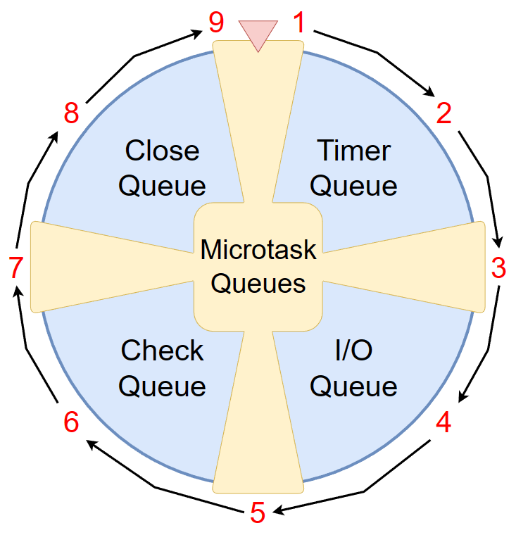
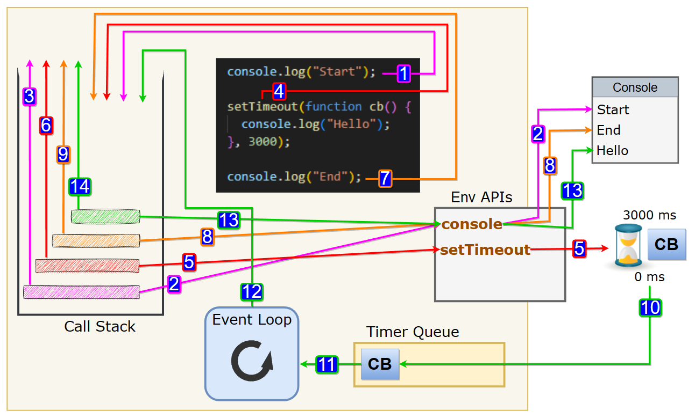

<p align="center">
  
</p>

<h1 align="center">JavaScript</h1>

<p align="center">
  -
<p>

> Pain.

<p align="right">
    <a href="https://github.com/shaanaliyev/tech-stack#tech-stack">Main Page ↖</a>
</p>

#### Knowledge requirements

- No previous knowledge is required!

### Contents

1. [How JS Works?](#-how-js-works)
   - [Code Execution](#-code-execution)
   - [Async JavaScript](#-async-javascript)
2. [Core JS concepts](#-core-js-concepts)
   - [Hoisting](#-hoisting)
   - [Block Scope](#-block-scope)
   - [Function Environment](#-function-environment)
   - [Closures](#-closures)

> **Note**:
> This is not a comprehensive JavaScript course, which means it doesn't cover every topic in JavaScript. However, I will provide you with some resources to learn the parts that haven't been mentioned.

<br>

<hr>

## 🔶 How JS Works?

JavaScript (JS) is a programming language that runs on a combination of a JavaScript engine and a runtime environment.

- JS Engine: is a program or a virtual machine that interprets and executes JavaScript code.
  > It takes in the JavaScript source code, parses it, and converts it into executable instructions that can be understood by the computer's hardware. The engine handles tasks such as lexical analysis, syntax parsing, bytecode generation or just-in-time (JIT) compilation, and execution of the JavaScript code. V8 is the most popular JavaScript engine, used in Google Chrome and Node.js.
- Runtime Environment: provides the necessary libraries, APIs, and tools for executing JavaScript code.
  > It provides a set of pre-defined objects and functions that JavaScript code can use to interact with the environment it's running on.

<br>

### 🔷 Code Execution

A JavaScript engine typically has two important components when it comes to code execution:

- `Memory Heap`: This is where dynamic memory allocation occurs.
  > It is responsible for allocating and managing memory for objects and variables created during the execution of a JS program. Objects and variables are stored in the memory heap until they are no longer needed or explicitly deallocated.
- `Call Stack`: The call stack keeps track of the execution context of a program.

  > The call stack operates on a last-in, first-out (LIFO) principle, meaning that the most recently pushed execution context is the first one to be popped off and executed.

  > When a function is called, its execution context is pushed onto the call stack.

  > As functions are nested within each other, their execution contexts are stacked on top of each other in the call stack.

When you run a JavaScript program, the JavaScript Engine creates an environment called the **Execution Context**, which manages the entire code execution.

> The first (bottom) layer Execution Context (EC) in the call stack is called the Global Execution Context (GEC).

Execution Context (EC) has two phases:

1. Creation Phase.

   > JavaScript reads the entire program line by line and allocates memory to all variables and functions.

   > In this phase, variables are allocated memory space and assigned the initial value of `undefined`, and functions are allocated memory space as their entire function reference.

2. Code Execution Phase.
   > JavaScript runs through the entire program once again, line by line, and executes the code. This phase is where all variable assignments, logical functions, and calculations are performed.

<br>

**Example:**

```js
const n = 10;
function square(num) {
  const result = num * num;
  return result;
}

let myVar1 = square(n);
let myVar2 = square(4);
```

- Creation Phase:
  1. `n: undefined`
  2. `square: { ... }`
  3. `myVar1: undefined`
  4. `myVar2: undefined`
- Code Execution Phase:
  1.  `n: 10`
  2.  We jump over this function declaration part since there is nothing to execute.
  3.  We invoke/execute the function `square(10)`.
      > When we invoke a function, a brand-new Execution Context (EC) is created under the GEC, and the following phases are applied again for it:
      - Creation Phase:
        1. `num: undefined` (the parameter)
        2. `result: undefined`
        3. There is no action required for the Return statement in the Creation Phase, so we skip over it.
      - Code Execution Phase:
        1. `num: 10` (the parameter)
        2. `result: 100` (100 comes from `num * num` --> `10*10`)
        3. The Return statement indicates that the function has completed and returns control to the point where the function was invoked. When the function returns, it assigns the returned value: `myVar1: 100`.
  4.  The same invocation/execution process is repeated for `square(4)`, which returns 16 to `myVar2`.

> This is how execution contexts are viewed in action within the call stack:

> 1. The program starts.
> 2. A Global Execution Context (GEC) is created.
> 3. The code starts running step by step, from top to bottom.
> 4. A function call `square(10)` is encountered, and a new Execution Context (E1) is created for executing the function.
> 5. Execution of `square(10)` is completed, and E1 is deleted.
> 6. Another function call `square(4)` is encountered, and a new Execution Context (E2) is created for executing the function.
> 7. Execution of `square(4)` is completed, and E2 is deleted.
> 8. The GEC is deleted from the Call Stack since there is nothing else to execute.
> 9. The program stops.

> When a function is called, its execution context is pushed onto the call stack. The call stack operates on a last-in, first-out (LIFO) principle, which implies that JavaScript executes code sequentially, following a specific order of execution. While the function is being executed, no other code can be executed until the function completes and its execution context is popped off the call stack. This behavior indicates that **JavaScript processes code in a single-threaded manner**, as it can only handle one task at a time.

<br>

### 🔷 Async JavaScript

As you can see by now, we know that the Call Stack has one job: to execute what it receives directly, frame by frame, as a stack (first in, last out). It runs the code synchronously, not asynchronously. But how does JavaScript get its asynchronous power? The answer is: **Environment APIs**.

Environment APIs are part of the JavaScript runtime environment (e.g., web browser or Node.js) and provide functionalities beyond the core language features.

> These APIs allow JavaScript to interact with the environment outside of the Call Stack, such as making HTTP requests, setting timers, or manipulating the Document Object Model (DOM). When JavaScript code invokes these APIs, it essentially orders or requests certain actions to be performed.

> The JavaScript runtime environment handles these requests and delegates the work to the appropriate parts of the system. For example, when making an HTTP request, the runtime environment interacts with the networking subsystem of the operating system or uses browser APIs to initiate the request and handle the response.

> Here are some examples of environment APIs in JavaScript: `setTimeout`, `setInterval`, `fetch`, `localStorage`, `sessionStorage`, `Geolocation`, etc.

<br>

#### 🔻 Overall mechanism

The things that you need to know first:

- Callback?
  > A callback in JavaScript is a function passed as an argument to another function, which is invoked later, often asynchronously or in response to an event. It allows for handling asynchronous operations by executing code when a certain task is completed or an event occurs.
- Execution Queues:
  > Execution Queues are first-in, first-out (FIFO) data structures that hold callback functions awaiting execution. The specific queue in which a callback function resides is defined by its trigger.
  - Microtask Queues.
    - nextTick Queue:
      > The callback functions triggered by `process.nextTick()` sit inside this queue.
    - Promise Queue:
      > The callback functions triggered by Promises.
  - Macrotask Queues (Callback Queues / Message Queues).
    - Timer Queue:
      > The callback functions triggered by either `setTimeout()` or `setInterval()`.
    - I/O Queue:
      > The callback functions triggered by most of the built-in async modules, such as reading/writing files (`fs.readFile()`), etc.
    - Check Queue:
      > The callback functions triggered by `setImmediate()`.
    - Close Queue:
      > Callback functions related to the closing of resources or processes.

<br>

**Event Loop:**

The Event Loop is a fundamental concept in JavaScript that is responsible for managing the execution of asynchronous operations.

> When an asynchronous operation/task completes, the operator gets triggered, and its corresponding callback function is placed in one of the queues listed above, depending on the task source.

> A registered callback function can be triggered in the following ways: `addEventListener` click event (button click), `setTimeout` expiration of a specified time interval, `fetch('url')` obtaining a response from an endpoint, etc.

> On the other side, the event loop itself continuously checks if the Call Stack is empty, and if it is, it picks the top callback function from the queues, considering their execution order, and pushes it onto the call stack for execution.

> The queues have priorities over each other. That means one type of queue should wait for a different type of queue to empty completely if it has lower priority compared to it.

The execution sequence/phases (one circle):

> 1. Microtask Queues (first nextTick queue, then Promise queue).
> 2. Timer Queue.
> 3. Microtask Queues (first nextTick queue, then Promise queue).
> 4. I/O Queue.
> 5. Microtask Queues (first nextTick queue, then Promise queue).
> 6. Check Queue.
> 7. Microtask Queues (first nextTick queue, then Promise queue).
> 8. Close Queue.
> 9. Microtask Queues (first nextTick queue, then Promise queue).
> 10. If there are more callbacks or tasks remaining to be processed, the event loop goes back to step #1. Otherwise, it terminates (or enter a wait state until new events or callbacks arrive).

  <p align="center">
    
  </p>

Example #1:

```js
console.log("Start");

setTimeout(function cb() {
  console.log("Hello");
}, 3000);

console.log("End");
```

<p align="center">
  
</p>

> This shows how the overall execution phase process goes for the given code.

<br>

Example #2:

```js
console.log("11111");

setTimeout(() => {
  console.log("22222");
}, 0);

Promise.resolve().then(() => {
  console.log("33333");
});

console.log("44444");

// Output:
// 11111
// 44444
// 33333
// 22222
```

> 1. As you can see, '11111' and '44444' goes first because they are sync 1st class code they don't have any relation with event loop. The GEC takes care about 1st class code, the Event Loop has no chance before it.

> After GEC ends its job (executing sync 1st class code), the Event Loop comes into the picture.

> 2. The Event Loop sees both of the callbacks ready and waiting to be executed in their corresponding task queues, but it chooses '33333' because it gets triggered by a Promise. Promises are microtasks and they have priority over other macro tasks, regardless of the setTimeout being set to 0 milliseconds.

> 3. Finally, '22222' gets printed, as we know it belongs to the least prioritized task among the tasks inside the given code.

If you want to see explanations with more examples, I recommend you watch: [YouTube playlist](https://www.youtube.com/watch?v=L18RHG2DwwA&list=PLC3y8-rFHvwj1_l8acs_lBi3a0HNb3bAN&pp=iAQB).

<br>

**User-triggered events:**

> You may ask, 'Okay, I understand the timers, I/O, etc., but what about EventListeners? What is the exact priority of callback functions triggered using addEventListener (user click) compared to microtask and macrotask queue callbacks in the Event Loop?'

```js
document.getElementById("test").addEventListener("click", () => {
  console.log("????");
});
```

Please take a look at the question and its accepted answer: [Stackoverflow](https://stackoverflow.com/questions/76673558/what-is-the-priority-of-eventlistener-callback-functions-in-the-event-loop).

>

<br>

**Overall mechanism summary:**

> 1. When an asynchronous operation is invoked, it is typically handled by the environment API, which manages the operation separately from the Call Stack.
> 2. The environment API initiates the operation, registers a callback function (e.g., timer starts), and then continues executing the main (1st class) code in the Call Stack.
> 3. Once the asynchronous operation completes (triggered by an event such as a timer expiration or an HTTP response being received), the environment API places the corresponding callback function into an appropriate queue.
> 4. The Event Loop continuously checks the state of the Call Stack. If the Call Stack is empty, meaning nothing is currently being executed, the Event Loop takes the first callback function from the appropriate queue and pushes it onto the Call Stack.
> 5. Once the callback function is pushed onto the Call Stack, it is executed synchronously like any other 1st class code.

 <p align="right">
    <a href="#javascript">back to top ⬆</a>
</p>

<br>
<br>

## 🔶 Core JS concepts

### 🔷 Hoisting

Hoisting is a behavior that allows you to use a variable or function before it is declared.

```js
getName(); // JavaScript

console.log(a); // undefined

var a = 11;
console.log(a); // 11

function getName() {
  console.log("JavaScript");
}

console.log(x); // ReferenceError: x is not defined
```

> **Note**:
> `undefined` and `not defined` are different things.
>
> - **Undefined**: It means that the variable exists in memory but does not have a specific value assigned to it yet. It can be thought of as a placeholder or a default state for variables.
> - **Not Defined**: The variable or function doesn't exist in memory (the program is not aware of its existence).

**How does hoisting occur?**

> This behavior is due to the Memory Creation Phase of the Execution Context (EC). As we know, during this phase, JavaScript reads the entire program line by line and allocates memory to all variables and functions.

> After completing this phase, the Execution Context (EC) enters its second phase, the Code Execution Phase. During this phase, the EC executes the code line by line, accessing the allocated values and utilizing them.

> That is why we get "undefined" for `console.log(a);`. It directly reads the allocated memory and takes the value (which is "undefined" before its initialization). The same goes for the `getName();` function. The execution context sees the entire code block in memory and just runs it (functions are allocated in memory as they are).

**So, what is wrong with it?**

> It is a natural behavior in JavaScript that cannot be avoided, and there is nothing wrong with it. However, this behavior can sometimes lead to unexpected results if it is not understood properly.

**Best practices to follow?**

- Use `let` and `const` keywords instead of `var`, as they have block-level scope and are not hoisted to the top of their scope.
- Use function expressions (using `const` or `let`) instead of function declarations.

```js
console.log(a); // ReferenceError: Cannot access 'a' before initialization
let a = 15;

console.log(b); // ReferenceError: Cannot access 'b' before initialization
const b = 20;

getName(); // ReferenceError: Cannot access 'getName' before initialization

const getName = () => {
  console.log("JavaScript");
};
```

**What is special about `let` and `const`?**

During the Memory Allocation Phase:

- `let`, `const`: Stored in the TDZ (temporal dead zone) instead of global memory.
  > This means they can only be accessed after initialization, and attempting to access them before initialization will throw a ReferenceError. Furthermore, it is not allowed to redeclare a variable with the same name in the same scope.
- `var`: Saved in global memory, allowing us to access it at any point.
  > However, it is "undefined" before initialization.

What is TDZ (temporal dead zone)?

> The TDZ is the period of time between the declaration of a variable with `let` or `const` and the assignment of a value to that variable.

<br>

### 🔷 Block Scope

In JavaScript, block scope refers to the visibility and accessibility of variables within a specific block of code, typically defined by curly braces `{}`.

> Variables declared using the `let` and `const` keywords are limited to the block in which they are defined.

A block can be a loop (`for`, `while`, `do-while`), an `if` statement, or simply a block of code surrounded by curly braces.

> These control flow constructs expect a statement after them.

```js
if (true) console.log("Hello");
```

> When multiple statements need to be used together, they can be grouped by using block scopes.

```js
if (true) {
  console.log("Hello");
  const a = 10;
  console.log(a);
}
```

<br>

#### 🔻 Visibility and lifetime

- `var`: Hoisted in the global scope and available outside of the scope.
- `let/const`: Hoisted within its block scope and only available there (or in its child/inner scopes).

```js
if (true) {
  var a = 1;
  let b = 10;
  const c = 100;

  console.log(a); // 1
  console.log(b); // 10
  console.log(c); // 100

  if (true) {
    console.log(c); // 100
    var d = 1000;
  }
}

console.log(a); // 1
console.log(b); // ReferenceError: b is not defined
console.log(c); // ReferenceError: c is not defined
console.log(d); // 1000
```

<br>

#### 🔻 Shadowing

Shadowing refers to the situation where a variable declared in an inner scope has the same name as a variable in an outer scope. This can lead to the inner variable "shadowing" or hiding the outer variable, making it inaccessible within the inner scope.

> When shadowing occurs, any references to the variable within the inner scope will refer to the inner variable, not the outer one.

```js
let a = 5; // Outer variable

if (true) {
  let a = 10; // Inner variable, shadows the outer 'x'
  console.log(a); // 10
}

console.log(a); // 5
```

<br>

### 🔷 Function Environment

Each time a function is called, a new local environment is created, which includes the function's arguments, local variables.

> Variables declared within a function are considered local variables and are only accessible within the function's local environment. They cannot be accessed from outside the function or from other functions unless they are explicitly returned.

> The local environment has access to the memory of its parent environment. If it does not find a value in the local memory, it searches one scope higher (parent) until it either finds the value or encounters a 'not defined' error.

<br>

**Example #1:**

```js
let a = 10;
let b = 20;

console.log(a); // 10
console.log(b); // 20

func1();
func2();
func3();
func4();

function func1() {
  let a = 11;
  console.log(a); // 11

  var c = 100; // a local variable (even though it uses the 'var' keyword)
}

function func2() {
  let a = 12;
  console.log(a); // 12
  console.log(c); // ReferenceError: c is not defined
}

function func3() {
  console.log(a); // 10 (It's accessing the outer variable because it couldn't find an inner one for "a".)
}

function func4() {
  b = 21; // It's accessing the outer variable and updating it.
  console.log(b); // 21
}

console.log(a); // 10
console.log(b); // 21
console.log(c); // ReferenceError: c is not defined
```

<br>

**Example #2:**

To find x:

> 1. Searching in the local memory of `b()`. Couldn't find.
> 2. Searching one level up in the local memory of its parent, a(). Couldn't find it.
> 3. Searching one level up in the GEC's memory. Found and assigned.

```js
function a() {
  b();
  function b() {
    console.log(x); // 2
  }
}
let x = 2;
a();
```

Some extra usage examples that change the output.

> undefined

```js
...
a();
var x = 2;
```

> Cannot access 'x' before initialization

```js
...
a();
let x = 2;
```

<br>

### 🔷 Closures

Closures are functions that can access values outside of their own curly braces.

> They are functions bundled together with references to their surrounding state (lexical environment).

Some common use cases:

- Data Privacy:
  > Closures allow for the creation of private variables and functions. By encapsulating variables and methods within a closure, you can prevent direct access or modification from outside the function.
- Function Factories:
  > Closures enable the creation of function factories, where you can generate and return specialized functions based on specific parameters or configurations.
- Memoization:
  > Closures can be employed for memoization, which is a technique that caches the results of expensive function calls to optimize performance.

<br>

**Example #1:**

```js
function x() {
  let a = 10;
  let b = 9;

  function y() {
    let b = 99; // shadowing b
    console.log(a); //
    console.log(b); //
  }

  a = 100; // updating a

  return y; // returns y() with its lexical environments
}

let z = x();

console.log(z); // y() { let b = 99; console.log(a); console.log(b); }

z(); // 100  // 99
```

> The closure `z` remembers its environment `a` and `b` when returning the result.

<br>

**Example #2:**

```js
function x() {
  function y() {
    let b = 99; // shadowing b
    console.log(a); //
    console.log(b); //
  }

  let a = 10;
  let b = 9;

  return y; // returns y() with its lexical environments
}

let z = x();

console.log(z); // y() { let b = 99; console.log(a); console.log(b); }

z(); // 10  // 99
```

<br>

**Example #3:**

```js
function addNumber(x) {
  return function (y) {
    return x + y;
  };
}

const addFive = addNumber(10);
console.log(addFive); // (y) { return x + y; }
console.log(addFive(2)); // 12
console.log(addFive(5)); // 15
```

<br>

**Example #4:** (Data privacy)

> `count` is not directly accessible outside of the program, but we can maintain its state.

```js
function increment() {
  let count = 0;
  return () => {
    count++;
    return count;
  };
}

const up = increment();
const up2 = increment();

console.log(up()); // 1
console.log(up()); // 2
console.log(up()); // 3
console.log(up()); // 4

console.log(up2()); // 1
console.log(up2()); // 2
console.log(up2()); // 3

console.log(count); // ReferenceError: count is not defined
```

> To prevent global variable leakage, it is efficient to use an Immediately Invoked Function Expression (IIFE): `(()=> { your code })();`

<br>

**Example #5:** (React `useState` hook)

```js
const useState = (curr) => {
  return [() => curr, (newState) => (curr = newState)];
};

const [curr, update] = useState("Hello!");

console.log(curr()); // Hello!
console.log(curr()); // Hello!
console.log(update("Hi!")); // Hi!
console.log(curr()); // Hi!
console.log(curr()); // Hi!
```
